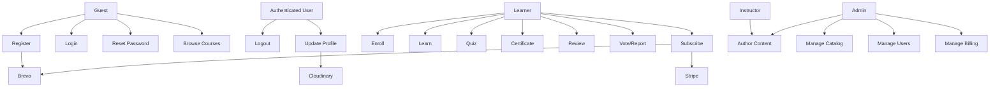

# Use Cases

Use cases describe interactions between actors and the system. Actors: **Guest**, **Learner**, **Instructor**, **Admin**, and external systems (**Stripe**, **Cloudinary**, **Brevo**).

## 1. Actor Overview

| Actor | Description | Authentication |
|---|---|---|
| Guest | Unauthenticated visitor | No |
| Learner | Registered user consuming content | Session cookie |
| Instructor | User who authors/manages owned courses | Session cookie |
| Admin | Platform administrator | Session cookie |
| Stripe | Payment processor (checkout + webhook) | Signature |
| Cloudinary | Image storage | API credentials |
| Brevo | Transactional email | API key |

## 2. Use Case Catalog

| ID | Name | Primary Actor | Related Requirements |
|---|---|---|---|
| UC-01 | Register account | Guest | FR-AUTH-01/02/03 |
| UC-02 | Log in | Guest | FR-AUTH-04/05 |
| UC-03 | Log out | Learner/Instructor/Admin | FR-AUTH-07 |
| UC-04 | Reset password | Guest | FR-AUTH-08/09/10 |
| UC-05 | Update profile | Learner/Instructor/Admin | FR-PROF-01..04 |
| UC-06 | Browse and search courses | Guest/Learner | FR-CAT-03/09 |
| UC-07 | Enroll in a course | Learner | FR-LRN-01/02 |
| UC-08 | Learn lessons and track progress | Learner | FR-LRN-03/04/06 |
| UC-09 | Take a quiz | Learner | FR-QUIZ-01..04 |
| UC-10 | Claim a certificate | Learner | FR-CERT-01..03 |
| UC-11 | Review a course | Learner | FR-REV-01 |
| UC-12 | Vote/report a review | Learner | FR-REV-04/05 |
| UC-13 | Purchase a subscription | Learner/Stripe | FR-SUB-01..07 |
| UC-14 | Manage catalog (categories/courses) | Admin | FR-CAT-01/02/04, FR-ADM-01 |
| UC-15 | Author course content | Instructor/Admin | FR-CONT-01..10 |
| UC-16 | Manage users/instructors | Admin | FR-ADM-02 |
| UC-17 | Manage subscriptions & payments | Admin | FR-SUB-08 |

## 3. Detailed Use Cases

### UC-01 — Register Account
- **Primary actor:** Guest
- **Preconditions:** Valid email not already registered.
- **Main flow:**
  1. Guest opens the signup form.
  2. Enters name, email, password, accepts terms.
  3. System validates input.
  4. System hashes the password and creates `users` + `user_profiles`.
  5. System creates a session and sends a welcome email.
  6. Frontend stores auth state and redirects to the dashboard.
- **Alternative flows:**
  - 3a. Validation fails → HTTP 422 with the first error.
  - 4a. Email exists → HTTP 409.
- **Postconditions:** User is authenticated with a persisted session.

### UC-02 — Log In
- **Primary actor:** Guest
- **Preconditions:** Registered account.
- **Main flow:**
  1. Guest submits email/password.
  2. System verifies credentials with bcrypt.
  3. System creates a session and updates `last_login`.
  4. Frontend fetches `GET /users/me` and routes to the dashboard.
- **Alternative flows:** Invalid credentials → HTTP 401; rate limit → HTTP 429.
- **Postconditions:** Authenticated session cookie set.

### UC-03 — Log Out
- **Primary actor:** Any authenticated user
- **Main flow:** Client calls `POST /users/logout`; system destroys the session; frontend clears auth state and redirects to login.
- **Postconditions:** Session and cookie cleared.

### UC-04 — Reset Password
- **Primary actor:** Guest
- **Main flow:**
  1. Guest submits their email.
  2. System generates a 6-digit code, stores its SHA-256 hash with a 10-minute expiry, and emails the code.
  3. Guest submits the code; system verifies it.
  4. Guest submits a new password; system updates the hash and invalidates the code.
- **Alternative flows:** Expired/invalid/over-attempted code → rejected; rate limits apply.
- **Postconditions:** Password changed; user can log in.

### UC-05 — Update Profile
- **Primary actor:** Authenticated user
- **Main flow:** User edits name/email/profile fields and optionally uploads an avatar; system validates, uploads to Cloudinary, and persists changes.
- **Alternative flows:** Invalid/oversized image → rejected; duplicate email → HTTP 409.

### UC-06 — Browse and Search Courses
- **Primary actor:** Guest/Learner
- **Main flow:** Client requests course list with query params (`page`, `limit`, `sort`, `search`, filters); system returns a paginated list with metadata; client opens course detail.
- **Postconditions:** User can view course details and pricing.

### UC-07 — Enroll in a Course
- **Primary actor:** Learner
- **Preconditions:** Authenticated; not already enrolled.
- **Main flow:**
  1. Learner clicks enroll on a course.
  2. System checks access type.
  3. System creates an `enrollments` row.
  4. System seeds a `learn_progress` row pointing at the first lesson.
  5. Frontend redirects to the first lesson.
- **Alternative flows:**
  - 3a. Already enrolled → duplicate rejected.
  - 2a. Subscription-only and no active subscription → access blocked.
- **Postconditions:** Learner has access to course lessons.

### UC-08 — Learn Lessons and Track Progress
- **Primary actor:** Learner
- **Main flow:**
  1. Learner opens the learning route.
  2. System returns the course hierarchy and current progress.
  3. Learner views lesson content (sanitized HTML).
  4. On navigation/completion, system updates `learn_progress` and inserts `lesson_completion`.
  5. Dashboard reflects in-progress/completed courses.
- **Postconditions:** Progress and completion recorded.

### UC-09 — Take a Quiz
- **Primary actor:** Learner
- **Main flow:**
  1. Learner opens a QUIZ lesson.
  2. System returns questions and options.
  3. Learner selects answers and submits.
  4. System evaluates correctness and shows results/explanations.
  5. Completion/progress is updated.
- **Postconditions:** Quiz attempt results shown; completion recorded.

### UC-10 — Claim a Certificate
- **Primary actor:** Learner
- **Main flow:**
  1. Learner checks eligibility.
  2. If eligible, learner claims the certificate.
  3. System creates a certificate with a unique number.
  4. Learner can view/list certificates.
- **Alternative flows:** Ineligible → claim blocked.

### UC-11 — Review a Course
- **Primary actor:** Learner
- **Main flow:** Learner submits a rating (1–5) and optional text; system stores the review and updates the summary.
- **Alternative flows:** Rating out of range → 422; duplicate review → 409.

### UC-12 — Vote/Report a Review
- **Primary actor:** Learner
- **Main flow:** Learner toggles a helpful vote and/or reports a review with a reason; system stores the record.
- **Alternative flows:** Duplicate vote toggles; duplicate report rejected.

### UC-13 — Purchase a Subscription
- **Primary actors:** Learner, Stripe
- **Main flow:**
  1. Learner selects a plan and requests payment.
  2. System creates a Stripe Checkout session and returns its URL.
  3. Learner pays on Stripe.
  4. Stripe calls the webhook with `checkout.session.completed`.
  5. System creates the user subscription and a completed payment, expires prior active subscriptions, and sends a confirmation email.
  6. Learner returns to the success page and gains access.
- **Alternative flows:** Invalid webhook signature → rejected; payment canceled → cancel page.
- **Postconditions:** Learner has one active subscription and a payment record.

### UC-14 — Manage Catalog
- **Primary actor:** Admin
- **Main flow:** Admin creates/updates/deletes categories and courses through the dashboard; system enforces uniqueness and soft-delete rules.
- **Postconditions:** Catalog reflects changes.

### UC-15 — Author Course Content
- **Primary actor:** Instructor/Admin
- **Main flow:** Author manages objectives, modules, chapters, lessons, contents, quizzes, and options; system enforces ownership and position uniqueness.
- **Postconditions:** Course content tree is updated.

### UC-16 — Manage Users/Instructors
- **Primary actor:** Admin
- **Main flow:** Admin lists (paginated), creates, updates, or deletes users/instructors; system enforces role/status rules.
- **Postconditions:** User records reflect changes.

### UC-17 — Manage Subscriptions & Payments
- **Primary actor:** Admin
- **Main flow:** Admin manages plans, user subscriptions, and payments via tabs in the dashboard.
- **Postconditions:** Billing records reflect changes.

## 4. Use Case Relationships

