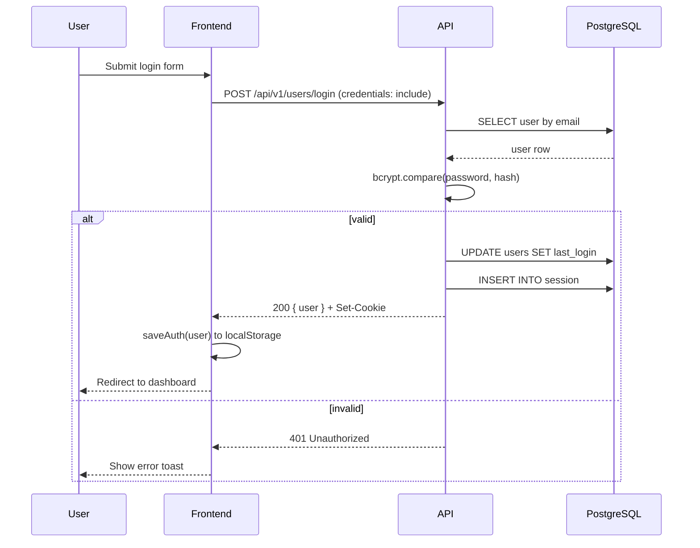
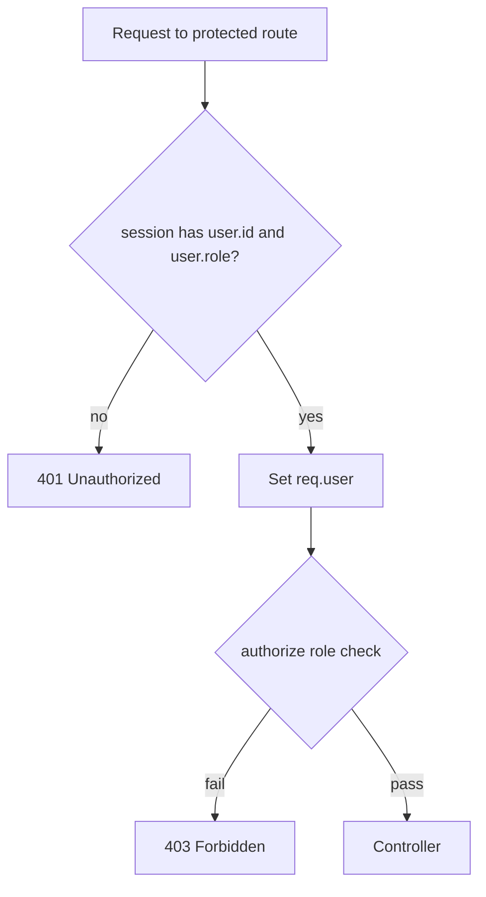
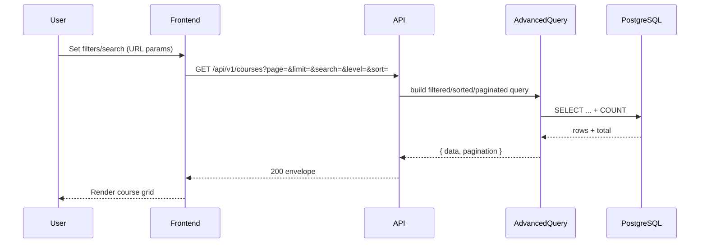
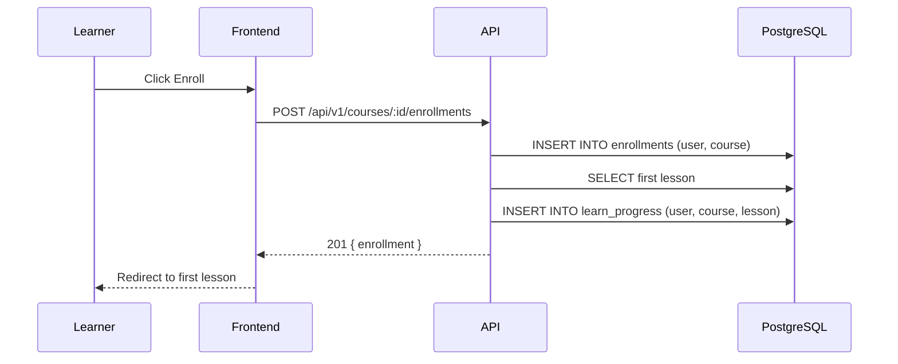
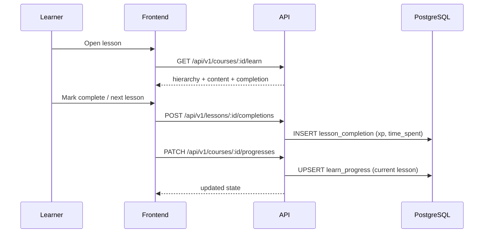
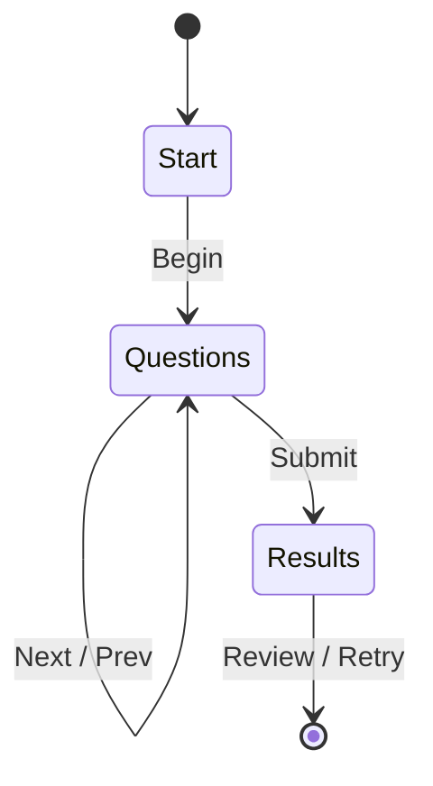
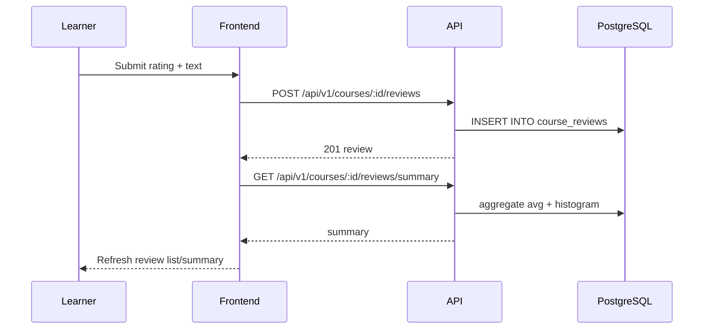
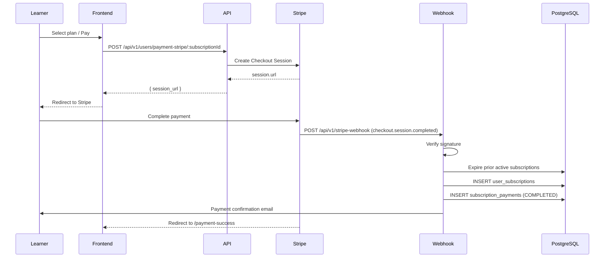
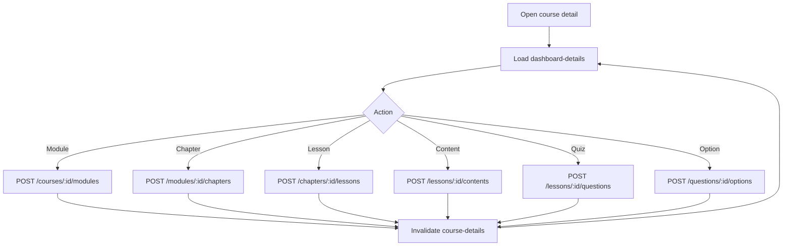
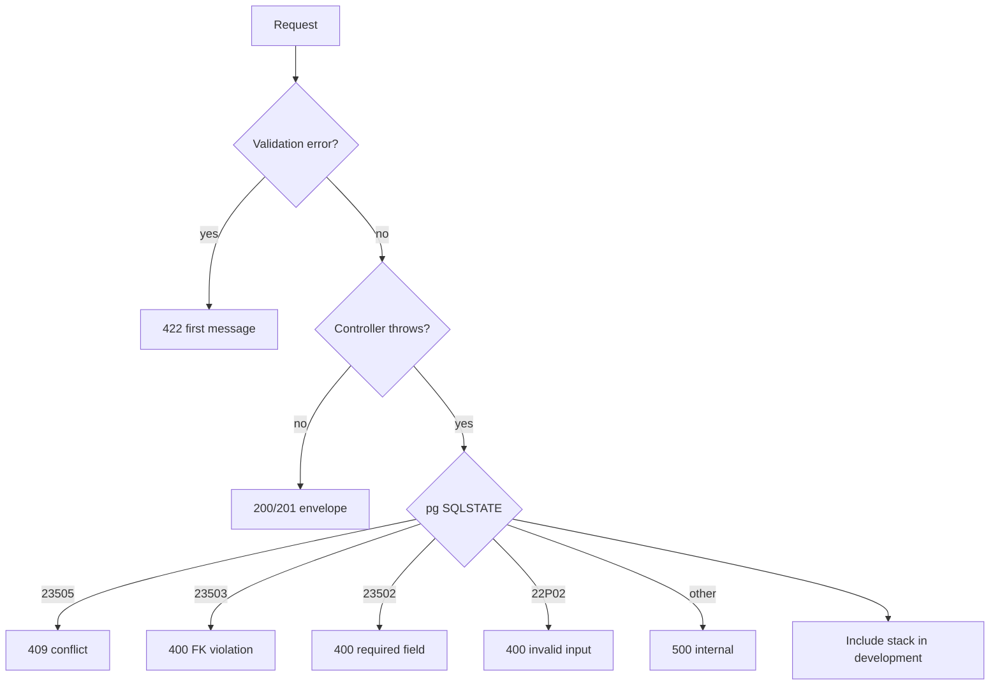

# Workflows

End-to-end workflows showing how requests flow through the frontend, backend, and database. Each workflow lists the participating files.

## 1. Authentication Workflow

**Participants:** `frontend/src/services/auth.js`, `frontend/src/api/client.js`, `backend/src/modules/auth/routes.js`, `backend/src/modules/auth/controller.js`, `backend/src/modules/auth/service.js`, `backend/src/common/services/HashService.js`, `backend/src/common/services/SessionService.js`, `backend/src/common/middleware/sessionMiddleware.js`.

Steps:

1. Frontend posts credentials via the API client with `credentials: "include"`.
2. Route runs validators then the `login` controller.
3. Controller looks up the user, verifies the password with bcrypt, updates `last_login`, and creates a session via `SessionService.create`.
4. Session is stored in PostgreSQL by `connect-pg-simple`; the HTTP-only cookie is returned.
5. Frontend persists user state and routes to the dashboard.

## 2. Session Validation Workflow

**Participants:** `backend/src/common/middleware/requireAuth.js`, `backend/src/common/middleware/authorize.js`, `backend/src/common/services/SessionService.js`.

`requireAuth` populates `req.user`; `authorize(...roles)` reads `req.session.user.role` and allows or rejects.

## 3. Course Discovery Workflow

**Participants:** `frontend/src/pages/CourseScreen.jsx`, `frontend/src/hooks/queries/useCourses.js`, `frontend/src/services/courses.js`, `backend/src/modules/courses/routes.js`, `backend/src/modules/courses/service.js`, `backend/src/modules/courses/repository.js`, `backend/src/common/query/AdvaceQuery.js`.

Filters supported by `CourseRepository` include `level`, `category`, `skill` (mapped to category slug), `rating`, `duration`, and `isFree` (access type). Sorting uses `-field` for descending.

## 4. Enrollment Workflow

**Participants:** `frontend/src/hooks/mutations/useCourseMutations.js`, `backend/src/modules/learning/enrollment.routes.js`, `backend/src/modules/learning/service.js`, `backend/src/modules/learning/repository.js`, `backend/src/modules/learning/progress.repository.js`.

Duplicate enrollments are prevented by the `UNIQUE(user_id, course_id)` constraint. Subscription-gated courses require an active subscription (checked when learning data is fetched).

## 5. Learning & Progress Workflow

**Participants:** `frontend/src/components/courseLearning/NextPrevious.jsx`, `frontend/src/components/courseLearning/LessonContent.jsx`, `frontend/src/hooks/mutations/useCourseMutations.js`, `backend/src/modules/learning/service.js`, `backend/src/modules/learning/controller.js`.

Lesson HTML is sanitized with DOMPurify before rendering.

## 6. Quiz Workflow

**Participants:** `frontend/src/components/courseLearning/quiz/Quiz.jsx`, `frontend/src/hooks/queries/useLessons.js`, `backend/src/modules/content/service.js`, `backend/src/modules/content/lesson.repository.js`.

The quiz endpoint returns questions with options; results are computed in the frontend state machine and completion is recorded through the completion workflow.

## 7. Review Workflow

**Participants:** `frontend/src/components/courseReview/ReviewContainer.jsx`, `frontend/src/hooks/mutations/useCourseMutations.js`, `backend/src/modules/reviews/controller.js`, `backend/src/modules/reviews/service.js`, `backend/src/modules/reviews/repository.js`.

Helpful votes toggle via `POST /reviews/:id/helpful-votes`; reports via `POST /reviews/:id/reports`.

## 8. Subscription & Payment Workflow

**Participants:** `frontend/src/components/pricing/PricingCard.jsx`, `frontend/src/hooks/mutations/useUserMutations.js`, `backend/src/modules/subscriptions/service.js` (`createStripeSession`), `backend/src/modules/subscriptions/webhook.routes.js`, `backend/src/common/services/EmailService.js`.

The webhook is mounted before JSON body parsing so it can verify the raw request body against the Stripe signature.

## 9. Admin Content Authoring Workflow

**Participants:** `admin/src/pages/CourseDetailPage.jsx`, `admin/src/hooks/course-details/*`, `admin/src/services/*Api.js`, `backend/src/routes/*`.

Each mutation invalidates the `['course-details', courseId]` query key, triggering a refetch that rehydrates the local content tree.

## 10. Error Handling Workflow

**Participants:** `backend/src/common/middleware/errorHandler.js`, `backend/src/common/errors/ApiError.js`, `backend/src/common/middleware/validateResult.js`.

All controllers are wrapped in `asyncHandler` so rejected promises reach the central error handler.
