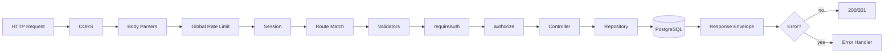

# Architecture

> **Backend refactor (structure complete):** the backend now follows the module-based architecture (`app/`, `config/`, `db/`, `common/`, `modules/`). Target: [`docs/08-refactoring/backend/01-structure.md`](../08-refactoring/backend/01-structure.md); tasks: [`docs/09-implement/tasks/`](../09-implement/tasks/); status: [`docs/09-implement/progress-tracking.md`](../09-implement/progress-tracking.md).

## 1. Overview

The platform is a three-tier application: two React SPAs (learner + admin) communicating over HTTP with a single stateless-in-process, session-backed Express API that owns a PostgreSQL database and integrates with three external services.

```text
+-------------------+        +-------------------+
| Learner Frontend  |        | Admin Dashboard   |
| React 19 + Vite   |        | React 19 + Vite   |
+---------+---------+        +---------+---------+
          |                            |
          |   HTTPS + session cookie   |
          +-------------+--------------+
                        |
               +--------v---------+
               |   Express 5 API  |
               |  /api/v1/*       |
               +--------+---------+
                        |
        +---------------+---------------+
        |               |               |
   +----v----+    +-----v-----+   +-----v-----+
   |Postgres |    |Cloudinary |   |  Stripe   |
   | +session|    |  images   |   | payments  |
   +---------+    +-----------+   +-----------+
                        |
                   +----v----+
                   |  Brevo  |
                   |  email  |
                   +---------+
```

## 2. Backend Architecture

### 2.1 Layered Pattern

The backend uses a strict layered architecture with no ORM:

| Layer | Location | Responsibility |
|---|---|---|
| Entry | `backend/src/server.js` | Verify DB connectivity, start HTTP server |
| App | `backend/src/app/app.js` | Middleware, CORS, session, route mounting, error handling |
| Routes | `backend/src/routes/` | URL → middleware chain → controller |
| Validators | `backend/src/validators/` | `express-validator` schemas |
| Middlewares | `backend/src/common/middleware/` | Auth, authorization, validation, rate limits, upload, errors, session |
| Controllers | `backend/src/controllers/` | Request orchestration, ownership checks, response shaping |
| Services | `backend/src/common/services/` | Cross-cutting domain services (session, hashing, email) |
| Repositories | `backend/src/repositories/` | Parameterized SQL and data access |
| Config | `backend/src/config/` | Env, DB pool, Cloudinary, schema |
| Utils | `backend/src/common/` | `ApiError`, `asyncHandler`, `AdvancedQuery`, 404 |
| Constants | `backend/src/common/constants/` | Status codes, domain constants |

### 2.2 Request Lifecycle



### 2.3 Middleware Order (`backend/src/app/app.js`)

1. `connectCloudinary()` at import time.
2. `app.set("trust proxy", 1)`.
3. CORS (credentials + allowed origins).
4. **Stripe webhook router** — mounted before body parsers so it can read the raw body.
5. `express.json()` and `express.urlencoded()`.
6. Morgan logging (development only).
7. `globalLimiter`.
8. `sessionMiddleware`.
9. Static `/uploads`.
10. Feature routers.
11. `notFoundUrl` (404).
12. `errorHandler`.

### 2.4 Response Envelope

```json
{
  "success": true,
  "statusCode": 200,
  "message": "OK",
  "data": { },
  "pagination": { "page": 1, "limit": 10, "total": 42, "totalPages": 5 }
}
```

Errors:

```json
{ "success": false, "statusCode": 422, "message": "Email is not valid" }
```

### 2.5 Data Access

Repositories are singleton classes holding raw parameterized SQL. List endpoints use `backend/src/common/query/AdvaceQuery.js` (`AdvancedQuery`), which builds filtered, searched, sorted, and paginated queries with `filterMap`/`sortMap` and `COUNT` metadata.

## 3. Frontend Architecture (Learner)

### 3.1 Composition

- `frontend/src/main.jsx` → `QueryClientProvider` → `ThemeProvider` → `AuthProvider` → `App`.
- `App.jsx` defines public routes, protected routes, and a separate learning layout.

### 3.2 State Management

| Concern | Mechanism |
|---|---|
| Server state | TanStack React Query |
| Auth/session | `AuthContext` + localStorage mirror |
| Theme | `ThemeContext` + localStorage |
| Filters/pagination | URL (`useSearchParams`) |
| Local UI state | `useState` |

### 3.3 Hook Organization

- Canonical: `hooks/queries/*` and `hooks/mutations/*`.
- Feature shims: `hooks/auth`, `hooks/course`, `hooks/user`, `hooks/subscription` re-export canonical hooks for naming compatibility.

### 3.4 API Client

`frontend/src/api/client.js` wraps `fetch` with `credentials: "include"`, JSON handling, 401 auto-logout/redirect, and pagination unwrapping. Services (`frontend/src/services/*`) expose domain methods.

## 4. Admin Architecture

- `admin/src/App.jsx` → Query client → providers → `ProtectedRoutes` → `AdminLayout` (sidebar + outlet).
- Auth bootstrapped via `useGetMe` (`GET /users/me`) with 10-minute stale time and no retry.
- Data flow: React Query hooks → service singletons → `/api/v1`.
- Course detail uses an orchestration hook (`use-course-detail`) composing CRUD hooks and local content-tree state.
- UI built from shadcn-style Radix primitives under `admin/src/components/ui`.

## 5. Cross-Cutting Concerns

| Concern | Approach |
|---|---|
| Authentication | Cookie session (`express-session` + `connect-pg-simple`) |
| Authorization | `requireAuth` + `authorize(...roles)` + per-resource ownership joins |
| Validation | `express-validator` schemas + `validateResult` (422) |
| Rate limiting | Global + password-reset + code-attempt limiters |
| File upload | `multer` disk storage → Cloudinary → local cleanup |
| Sanitization | `isomorphic-dompurify` on input; DOMPurify on render |
| Error handling | Central `errorHandler` with pg SQLSTATE mapping |
| Logging | Morgan (development) |
| CORS | Allowlist of two client origins with credentials |
| Pagination | `AdvancedQuery` + `pagination` metadata |

## 6. External Integrations

| Service | Purpose | Config | Used In |
|---|---|---|---|
| PostgreSQL | Primary data + sessions | `DATABASE_URL` | `configs/database.js` |
| Stripe | Checkout + webhook | `STRIPE_SECRET_KEY`, `STRIPE_WEBHOOK_SECRET` | `userControllers.js`, `webhookRoute.js` |
| Cloudinary | Image hosting | `CLOUDINARY_*` | `configs/cloudinary.js`, `userControllers.js` |
| Brevo | Transactional email | `BREVO_API_KEY`, `SENDER_EMAIL` | `services/EmailService.js` |

> Note: `nodemailer` and `resend` are listed as dependencies but are not used; email is sent via the Brevo REST API.

## 7. Deployment Topology

- Backend: Node process (Render target per README), `trust proxy` enabled.
- Frontends: static Vite builds served from separate origins.
- Database: managed PostgreSQL; schema applied from `schema.sql`.
- Production cookies: `secure` + `sameSite: "none"`, requiring HTTPS.

## 8. Architectural Constraints & Known Issues

| Item | Detail |
|---|---|
| No ORM | All SQL is hand-written in repositories; schema drift is not caught at compile time. |
| No migrations | Schema changes are manual; see `database-design.md` for drift findings. |
| No tests | No automated verification of architecture boundaries. |
| Nested routers | Routers using `mergeParams` are only functional when mounted under a parent with `:id`; top-level mounts of some are dead. |
| Unused login limiter | `loginLimiter` is defined but not applied. |
| Single-process sessions | Sessions are DB-backed, so horizontal scaling works, but `express-session` memory fallback must not be used in production. |

See `docs/diagrams/architecture.md` for the component/deployment diagram.
