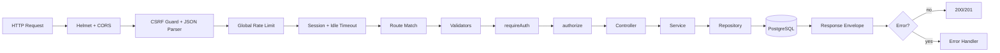

# Architecture

> **Progress:** the backend is module-based and hardened; the learner frontend and admin refactors are complete. See [`../progress/`](../progress/).

## 1. Overview

The platform is a three-tier application: two React SPAs (learner + admin) communicating over HTTP with a single stateless-in-process, session-backed Express API that owns a PostgreSQL database and integrates with three external services.

```text
+-------------------+        +-------------------+
| Learner Frontend  |        | Admin Dashboard   |
| React 19 + Vite   |        | React 19 + Vite   |
+---------+---------+        +---------+---------+
          |                            |
          |   HTTPS + session cookie   |
          +-------------+--------------+
                        |
               +--------v---------+
               |   Express 5 API  |
               |  /api/v1/*       |
               +--------+---------+
                        |
        +---------------+---------------+
        |               |               |
   +----v----+    +-----v-----+   +-----v-----+
   |Postgres |    |Cloudinary |   |  Stripe   |
   | +session|    |  images   |   | payments  |
   +---------+    +-----------+   +-----------+
                        |
                   +----v----+
                   |  Brevo  |
                   |  email  |
                   +---------+
```

## 2. Backend Architecture

### 2.1 Layered Pattern

The backend uses a strict layered architecture with no ORM:

| Layer | Location | Responsibility |
|---|---|---|
| Entry | `backend/src/server.js` | Verify DB connectivity, start HTTP server |
| App | `backend/src/app/` | `app.js` (wiring + errors), `middleware.js` (pipeline), `routes.js` (mounts) |
| Modules | `backend/src/modules/<module>/` | `routes.js`, `controller.js`, `service.js`, `repository.js`, `validation.js` |
| Middlewares | `backend/src/common/middleware/` | Auth, authorization, validation, CSRF, rate limits, upload, errors, session |
| Shared services | `backend/src/common/services/` | Cross-cutting services (session, hashing, email) |
| Repositories | `backend/src/modules/<module>/*.repository.js` | Parameterized SQL and data access |
| Config | `backend/src/config/` | Env, DB pool (+ `withTransaction`), Cloudinary, Stripe |
| DB | `backend/src/db/` | `schema.sql` + `migrations/` |
| Utils | `backend/src/common/` | `ApiError`, `asyncHandler`, `AdvancedQuery`, `logger`, 404 |
| Constants | `backend/src/common/constants/` | Status codes, domain constants |

### 2.2 Request Lifecycle



### 2.3 Middleware Order (`backend/src/app/middleware.js`)

1. `connectCloudinary()` at import time (in `app.js`).
2. `app.set("trust proxy", ...)` (configurable via `TRUST_PROXY`).
3. Helmet security headers.
4. CORS (credentials + allowed origins).
5. **Stripe webhook router** — mounted before body parsers so it can read the raw body.
6. CSRF guard (JSON-only + `X-Requested-With`).
7. `express.json()` (JSON only; `urlencoded` intentionally unsupported).
8. Morgan logging (development only).
9. `globalLimiter`.
10. `sessionMiddleware` (`session-middleware.js`).
11. Session idle timeout.
12. Feature routers (mounted in `backend/src/app/routes.js`).
13. `notFoundUrl` (404).
14. `errorHandler`.

### 2.4 Response Envelope

```json
{
  "success": true,
  "statusCode": 200,
  "message": "OK",
  "data": { },
  "pagination": { "page": 1, "limit": 10, "total": 42, "totalPages": 5 }
}
```

Errors:

```json
{ "success": false, "statusCode": 422, "message": "Email is not valid" }
```

### 2.5 Data Access

Repositories are singleton classes holding raw parameterized SQL. List endpoints use `backend/src/common/query/advanced-query.js` (`AdvancedQuery`), which builds filtered, searched, sorted, and paginated queries with `filterMap`/`sortMap` and `COUNT` metadata.

## 3. Frontend Architecture (Learner)

### 3.1 Composition

- `frontend/src/main.jsx` → `app/providers.jsx` (`QueryClientProvider` → `ThemeProvider` → `AuthProvider`) → `app/App.jsx`.
- `app/router.jsx` defines public routes, protected routes (`app/guards/`), and a separate learning layout.

### 3.2 State Management

| Concern | Mechanism |
|---|---|
| Server state | TanStack React Query |
| Auth/session | `AuthProvider` + `["me"]` query (server-derived) |
| Theme | `ThemeProvider` + localStorage |
| Filters/pagination | URL (`useSearchParams`) |
| Local UI state | `useState` |

### 3.3 Hook Organization

- Feature hooks live with their domain: `features/<domain>/hooks/*` (queries + mutations).
- Cross-cutting hooks live in `frontend/src/hooks/` (e.g. `useTheme`, `useScrollEffect`).

### 3.4 API Client

`frontend/src/lib/apiClient.js` wraps `fetch` with `credentials: "include"`, safe JSON parsing, `ApiError`, 401 auto-logout, and envelope unwrapping (`getPaginated` for lists). Query keys live in `frontend/src/lib/queryKeys.js`; feature services expose domain methods.

## 4. Admin Architecture

The admin SPA uses feature-based architecture parallel to the learner frontend:

- **App layer:** `app/` contains providers (QueryClient → AuthProvider → Router), guards (RequireAuth, RedirectIfAuthenticated), and route definitions (`app/router.jsx`). Entry is `app/App.jsx`.
- **Features:** Each domain lives in `features/<domain>/` (auth, dashboard, categories, users, courses, subscriptions, instructor, payouts) with subfolders: `pages/`, `components/`, `hooks/`, `services/`.
- **Role-gated instructor workspace:** `features/instructor/` + course-detail tabs (`students`/`analytics`/`reviews`/`certificates`) reuse the admin app. `RequireRole` guards routes; `constants/navItems.js` filters navigation by `user.role`; the backend scopes every instructor read by `courses.instructor_id`.
- **Data flow:** Page → Feature Component → Hook (useQuery/useMutation) → Service → `lib/apiClient.js` → Backend (`/api/v1/*`).
- **Infrastructure:** `lib/` contains `apiClient.js` (fetch wrapper, envelope unwrapping, ApiError, 401 auto-logout), `queryClient.js`, `queryKeys.js` (central factory), and `utils.js` (cn).
- **UI:** `components/` has `ui/` (shadcn/Radix primitives) and `common/` (reusable composables: DataTable, PaginationTable, FormModal, StatusBadge).
- **Layouts:** `AdminLayout` (sidebar + outlet) wraps all protected routes.
- **Rules:** no fetch in components, central query keys, feature-scoped code, 401 auto-redirect to /login.

## 5. Cross-Cutting Concerns

| Concern | Approach |
|---|---|
| Authentication | Cookie session (`express-session` + `connect-pg-simple`) |
| Authorization | `requireAuth` + `authorize(...roles)` + per-resource ownership joins |
| Validation | `express-validator` schemas + `validateResult` (422) |
| Rate limiting | Global + password-reset + code-attempt limiters + per-account lockout |
| File upload | `multer` disk storage → Cloudinary → local cleanup |
| Sanitization | `isomorphic-dompurify` on input; DOMPurify on render |
| Error handling | Central `errorHandler` with pg SQLSTATE mapping |
| Logging | Morgan (development) + structured `logger` / `logger.audit` |
| CORS | Allowlist of two client origins with credentials |
| Pagination | `AdvancedQuery` + `pagination` metadata |

## 6. External Integrations

| Service | Purpose | Config | Used In |
|---|---|---|---|
| PostgreSQL | Primary data + sessions | `DATABASE_URL` | `config/database.js` |
| Stripe | Checkout + webhook | `STRIPE_SECRET_KEY`, `STRIPE_WEBHOOK_SECRET` | `modules/subscriptions/*` |
| Cloudinary | Image hosting | `CLOUDINARY_*` | `config/cloudinary.js`, `modules/users/*` |
| Brevo | Transactional email | `BREVO_API_KEY`, `SENDER_EMAIL` | `common/services/email-service.js` |

> Note: `nodemailer` and `resend` are listed as dependencies but are not used; email is sent via the Brevo REST API.

## 7. Deployment Topology

- Backend: Node process (Render target per README), `trust proxy` enabled.
- Frontends: static Vite builds served from separate origins.
- Database: managed PostgreSQL; schema applied from `schema.sql`.
- Production cookies: `secure` + `sameSite: "none"`, requiring HTTPS.

## 8. Architectural Constraints & Known Issues

| Item | Detail |
|---|---|
| No ORM | All SQL is hand-written in repositories; schema drift is not caught at compile time. |
| Migrations | Plain SQL migrations in `backend/src/db/migrations/`; keep `schema.sql` in sync. |
| No tests | No automated verification of architecture boundaries. |
| Cross-module calls | Some module services still import other modules' repositories (BM-1). |
| Single-process sessions | Sessions are DB-backed, so horizontal scaling works, but `express-session` memory fallback must not be used in production. |

See `docs/diagrams/architecture.md` for the component/deployment diagram.
