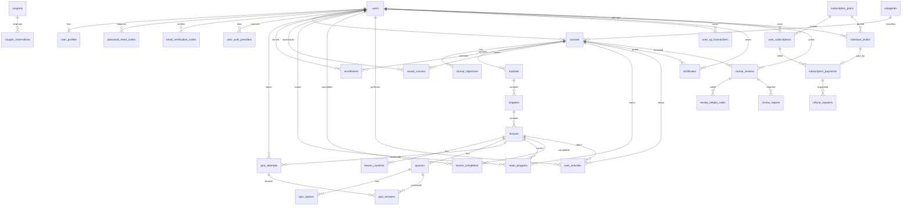

# Database Design

**Engine:** PostgreSQL
**Authoritative DDL:** `backend/src/db/schema.sql`
**Extension:** `pgcrypto` (for `gen_random_uuid()`)
**Migrations:** plain SQL in `backend/src/db/migrations/` (runner `npm run db:migrate`); no seed data.

## 1. Conventions

- Primary keys are `UUID DEFAULT gen_random_uuid()`.
- Timestamps use `TIMESTAMPTZ DEFAULT CURRENT_TIMESTAMP` unless noted.
- Tables with `updated_at` maintain it via the `set_updated_at()` trigger.
- Nearly all child foreign keys are `ON DELETE CASCADE`.
- List/aggregate queries use parameterized SQL in `backend/src/modules/<module>/*.repository.js`.

## 2. Entity Relationship Overview



## 3. Enum Types

| Enum | Values |
|---|---|
| `user_role` | `LEARNER`, `INSTRUCTOR`, `ADMIN` |
| `user_status` | `ACTIVE`, `INACTIVE`, `SUSPENDED` |
| `course_level` | `BEGINNER`, `INTERMEDIATE`, `ADVANCED` |
| `content_status` | `DRAFT`, `PUBLISHED` |
| `lesson_type` | `TEXT`, `QUIZ` |
| `subscription_status` | `ACTIVE`, `EXPIRED`, `CANCELLED`, `PENDING` |
| `payment_status` | `PENDING`, `COMPLETED`, `FAILED`, `REFUNDED`, `PARTIALLY_REFUNDED` |
| `checkout_order_status` | `CREATED`, `CHECKOUT_STARTED`, `PAID`, `FAILED`, `EXPIRED`, `CANCELLED` |
| `refund_request_status` | `PENDING`, `APPROVED`, `REJECTED`, `CANCELLED` |
| `discount_type` | `PERCENTAGE`, `FIXED_AMOUNT` |
| `refund_status` | `PENDING`, `SUCCEEDED`, `FAILED` |
| `access_course_type` | `FREE`, `SUBSCRIPTION` |
| `gender` | `MALE`, `FEMALE` |
| `user_activity_type` | `ENROLL_COURSE`, `START_COURSE`, `START_LESSON`, `COMPLETE_LESSON`, `COMPLETE_COURSE`, `EARN_CERTIFICATE` |

## 4. Tables

### 4.1 Identity & User

#### `users`

| Column | Type | Constraints |
|---|---|---|
| id | UUID | PK, `gen_random_uuid()` |
| name | VARCHAR(255) | NOT NULL |
| email | VARCHAR(255) | UNIQUE, NOT NULL |
| image_url | TEXT | nullable |
| password | VARCHAR(255) | nullable (bcrypt hash; `NULL` for provider-only accounts) |
| role | user_role | DEFAULT `LEARNER` |
| status | user_status | DEFAULT `ACTIVE` |
| failed_login_attempts | INTEGER | DEFAULT 0 |
| locked_until | TIMESTAMPTZ | nullable |
| email_verified_at | TIMESTAMPTZ | nullable (`NULL` = unverified) |
| last_login | TIMESTAMPTZ | nullable |
| created_at | TIMESTAMPTZ | DEFAULT now |
| updated_at | TIMESTAMPTZ | DEFAULT now |

#### `user_profiles`

| Column | Type | Constraints |
|---|---|---|
| id | UUID | PK |
| user_id | UUID | UNIQUE, NOT NULL, FK → users(id) CASCADE |
| bio | TEXT | nullable |
| location | VARCHAR(255) | nullable |
| phone | VARCHAR(20) | nullable |
| date_birth | DATE | nullable |
| gender | gender | nullable |
| created_at / updated_at | TIMESTAMPTZ | DEFAULT now |

One-to-one with `users`.

#### `password_reset_codes`

| Column | Type | Constraints |
|---|---|---|
| id | UUID | PK |
| user_id | UUID | NOT NULL, FK → users(id) CASCADE |
| code | VARCHAR(255) | NOT NULL (HMAC-SHA256 hex) |
| attempts | INTEGER | DEFAULT 0 |
| expires_at | TIMESTAMPTZ | NOT NULL |
| created_at / updated_at | TIMESTAMPTZ | DEFAULT now |

> The column is `VARCHAR(255)`; the stored value is an HMAC-SHA256 hex digest keyed with `SESSION_SECRET`. (Formerly `VARCHAR(6)` — resolved, see §9.)

#### `email_verification_codes`

| Column | Type | Constraints |
|---|---|---|
| id | UUID | PK |
| user_id | UUID | NOT NULL, FK → users(id) CASCADE |
| code | VARCHAR(255) | NOT NULL (HMAC-SHA256 hex) |
| attempts | INTEGER | DEFAULT 0 |
| expires_at | TIMESTAMPTZ | NOT NULL |
| created_at / updated_at | TIMESTAMPTZ | DEFAULT now |

Separate from `password_reset_codes` (distinct flows). A new code invalidates
previous ones; codes are single-use, expire after 10 minutes, and cap attempts
at 5. Added in migration `0013`.

#### `user_auth_providers`

| Column | Type | Constraints |
|---|---|---|
| id | UUID | PK |
| user_id | UUID | NOT NULL, FK → users(id) CASCADE |
| provider | VARCHAR(50) | NOT NULL (e.g. `GOOGLE`) |
| provider_user_id | VARCHAR(255) | NOT NULL (provider's stable subject id) |
| provider_email | VARCHAR(255) | nullable |
| created_at / updated_at | TIMESTAMPTZ | DEFAULT now |
| | | `UNIQUE (provider, provider_user_id)` |

Links external identities to `users`. The unique constraint maps a provider
identity to exactly one user; a user may have email/password and/or provider
logins. Added in migration `0014` (which also makes `users.password` nullable
for provider-only accounts).

### 4.2 Catalog & Content

#### `categories`

| Column | Type | Constraints |
|---|---|---|
| id | UUID | PK |
| name | VARCHAR(255) | UNIQUE, NOT NULL |
| slug | TEXT | UNIQUE, NOT NULL |
| description | TEXT | nullable |
| created_at / updated_at | TIMESTAMPTZ | DEFAULT now |

#### `courses`

| Column | Type | Constraints |
|---|---|---|
| id | UUID | PK |
| instructor_id | UUID | NOT NULL, FK → users(id) CASCADE |
| category_id | UUID | NOT NULL, FK → categories(id) **RESTRICT** |
| name | VARCHAR(255) | NOT NULL |
| slug | TEXT | UNIQUE, NOT NULL |
| description | TEXT | NOT NULL |
| status | content_status | DEFAULT `DRAFT`, NOT NULL |
| level | course_level | DEFAULT `BEGINNER`, NOT NULL |
| access_type | access_course_type | DEFAULT `FREE` |
| position | INTEGER | nullable |
| deleted_at | TIMESTAMPTZ | nullable (soft delete) |
| created_at / updated_at | TIMESTAMPTZ | DEFAULT now |

#### `course_objectives`

| Column | Type | Constraints |
|---|---|---|
| id | UUID | PK |
| course_id | UUID | NOT NULL, FK → courses(id) CASCADE |
| content | TEXT | NOT NULL |
| position | INTEGER | DEFAULT 1 |
| created_at / updated_at | TIMESTAMPTZ | DEFAULT now |

#### `modules`

| Column | Type | Constraints |
|---|---|---|
| id | UUID | PK |
| course_id | UUID | NOT NULL, FK → courses(id) CASCADE |
| position | INTEGER | NOT NULL |
| name | VARCHAR(255) | NOT NULL |
| description | TEXT | nullable |
| status | content_status | DEFAULT `DRAFT`, NOT NULL |
| created_at / updated_at | TIMESTAMPTZ | DEFAULT now |

Unique `(course_id, position)`. Index `idx_modules_course`.

#### `chapters`

| Column | Type | Constraints |
|---|---|---|
| id | UUID | PK |
| module_id | UUID | NOT NULL, FK → modules(id) CASCADE |
| position | INTEGER | NOT NULL |
| name | VARCHAR(255) | NOT NULL |
| description | TEXT | nullable |
| status | content_status | DEFAULT `DRAFT`, NOT NULL |
| created_at / updated_at | TIMESTAMPTZ | DEFAULT now |

Unique `(module_id, position)`. Index `idx_chapters_module`.

#### `lessons`

| Column | Type | Constraints |
|---|---|---|
| id | UUID | PK |
| chapter_id | UUID | NOT NULL, FK → chapters(id) CASCADE |
| position | INTEGER | NOT NULL |
| name | VARCHAR(255) | NOT NULL |
| description | TEXT | nullable |
| type | lesson_type | NOT NULL |
| status | content_status | DEFAULT `DRAFT`, NOT NULL |
| access_type | access_course_type | DEFAULT `FREE` |
| xp_points | INTEGER | DEFAULT 5, CHECK ≥ 0 |
| duration_minutes | INTEGER | DEFAULT 0, CHECK ≥ 0 |
| created_at / updated_at | TIMESTAMPTZ | DEFAULT now |

Unique `(chapter_id, position)`. Index `idx_lessons_chapter`.

#### `lesson_contents`

| Column | Type | Constraints |
|---|---|---|
| id | UUID | PK |
| lesson_id | UUID | NOT NULL, FK → lessons(id) CASCADE |
| position | INTEGER | NOT NULL |
| name | VARCHAR(255) | NOT NULL |
| content | TEXT | NOT NULL |
| created_at / updated_at | TIMESTAMPTZ | DEFAULT now |

Unique `(lesson_id, position)`. Index `idx_lesson_contents_lesson`.

#### `quizzes`

| Column | Type | Constraints |
|---|---|---|
| id | UUID | PK |
| lesson_id | UUID | NOT NULL, FK → lessons(id) CASCADE |
| question | TEXT | NOT NULL |
| explanation | TEXT | nullable |
| position | INTEGER | NOT NULL |
| created_at / updated_at | TIMESTAMPTZ | DEFAULT now |

Unique `(lesson_id, position)`. Index `idx_quizzes_lesson`.

#### `quiz_options`

| Column | Type | Constraints |
|---|---|---|
| id | UUID | PK |
| quiz_id | UUID | NOT NULL, FK → quizzes(id) CASCADE |
| text | TEXT | NOT NULL |
| is_correct | BOOLEAN | DEFAULT FALSE |
| position | INTEGER | NOT NULL |
| created_at / updated_at | TIMESTAMPTZ | DEFAULT now |

Unique `(quiz_id, position)`. Index `idx_quiz_options_quiz`.

#### `quiz_attempts`

| Column | Type | Constraints |
|---|---|---|
| id | UUID | PK |
| user_id | UUID | NOT NULL, FK → users(id) CASCADE |
| lesson_id | UUID | NOT NULL, FK → lessons(id) CASCADE |
| status | VARCHAR(20) | NOT NULL, DEFAULT `in_progress`, CHECK in (`in_progress`, `completed`, `abandoned`) |
| score | INTEGER | nullable, CHECK >= 0 |
| total_questions | INTEGER | nullable, CHECK > 0 |
| started_at | TIMESTAMPTZ | DEFAULT now |
| completed_at | TIMESTAMPTZ | nullable |

Indexes `idx_quiz_attempts_user_lesson`, `idx_quiz_attempts_lesson`. No `updated_at`/trigger. Each submit inserts a new completed attempt (retakes keep history).

#### `quiz_answers`

| Column | Type | Constraints |
|---|---|---|
| id | UUID | PK |
| attempt_id | UUID | NOT NULL, FK → quiz_attempts(id) CASCADE |
| quiz_id | UUID | NOT NULL, FK → quizzes(id) CASCADE |
| selected_option_id | UUID | nullable, FK → quiz_options(id) SET NULL |
| is_correct | BOOLEAN | NOT NULL |
| answered_at | TIMESTAMPTZ | DEFAULT now |

Unique `(attempt_id, quiz_id)`. Indexes `idx_quiz_answers_attempt`, `idx_quiz_answers_quiz`. No `updated_at`/trigger.

### 4.3 Learning

#### `enrollments`

| Column | Type | Constraints |
|---|---|---|
| id | UUID | PK |
| user_id | UUID | NOT NULL, FK → users(id) CASCADE |
| course_id | UUID | NOT NULL, FK → courses(id) CASCADE |
| access_type | access_course_type | DEFAULT `FREE` |
| enrolled_at | TIMESTAMPTZ | DEFAULT now |
| expires_at | TIMESTAMPTZ | nullable |
| updated_at | TIMESTAMPTZ | DEFAULT now |

Unique `(user_id, course_id)`. Indexes `idx_enrollments_user`, `idx_enrollments_course`. No `created_at`.

#### `saved_courses`

| Column | Type | Constraints |
|---|---|---|
| id | UUID | PK |
| user_id | UUID | NOT NULL, FK → users(id) CASCADE |
| course_id | UUID | NOT NULL, FK → courses(id) CASCADE |
| created_at | TIMESTAMPTZ | DEFAULT now |

Unique `(user_id, course_id)`. Indexes `idx_saved_courses_user`, `idx_saved_courses_course`. No `updated_at`/trigger (rows are only inserted/deleted).

#### `learn_progress`

| Column | Type | Constraints |
|---|---|---|
| id | UUID | PK |
| user_id | UUID | NOT NULL, FK → users(id) CASCADE |
| course_id | UUID | NOT NULL, FK → courses(id) CASCADE |
| current_lesson_id | UUID | nullable, FK → lessons(id) **SET NULL** |
| created_at / updated_at | TIMESTAMPTZ | DEFAULT now |

Unique `(user_id, course_id)`. Indexes `idx_learn_progress_user`, `idx_learn_progress_course`.

#### `lesson_completion`

| Column | Type | Constraints |
|---|---|---|
| id | UUID | PK |
| user_id | UUID | NOT NULL, FK → users(id) CASCADE |
| course_id | UUID | NOT NULL, FK → courses(id) CASCADE |
| lesson_id | UUID | NOT NULL, FK → lessons(id) CASCADE |
| completed_at | TIMESTAMP | NOT NULL, DEFAULT NOW() |
| created_at | TIMESTAMP | NOT NULL, DEFAULT NOW() |

Unique `(user_id, lesson_id)`. Indexes `idx_lesson_completion_user`, `idx_lesson_completion_lesson`. No `updated_at`/trigger. Time spent is **not** tracked; XP lives in `user_xp_transactions`.

#### `user_activities`

| Column | Type | Constraints |
|---|---|---|
| id | UUID | PK |
| user_id | UUID | NOT NULL, FK → users(id) CASCADE |
| course_id | UUID | nullable, FK → courses(id) CASCADE |
| lesson_id | UUID | nullable, FK → lessons(id) SET NULL |
| type | user_activity_type | NOT NULL |
| metadata | JSONB | NOT NULL, DEFAULT `{}` |
| created_at | TIMESTAMPTZ | DEFAULT now |

Append-only event log. Indexes `idx_user_activities_user_created`, `idx_user_activities_user_type`.

#### `user_xp_transactions`

| Column | Type | Constraints |
|---|---|---|
| id | UUID | PK |
| user_id | UUID | NOT NULL, FK → users(id) CASCADE |
| amount | INTEGER | NOT NULL |
| reason | TEXT | NOT NULL |
| reference_type | TEXT | nullable |
| reference_id | UUID | nullable |
| metadata | JSONB | NOT NULL, DEFAULT `{}` |
| created_at | TIMESTAMPTZ | DEFAULT now |

Single source of truth for XP. Partial unique index `unique_user_xp_reference (user_id, reason, reference_id) WHERE reference_id IS NOT NULL` prevents duplicate rewards. Index `idx_user_xp_transactions_user_created`.

#### `certificates`

| Column | Type | Constraints |
|---|---|---|
| id | UUID | PK |
| user_id | UUID | NOT NULL, FK → users(id) CASCADE |
| course_id | UUID | NOT NULL, FK → courses(id) CASCADE |
| confirm | BOOLEAN | DEFAULT FALSE |
| certificate_number | VARCHAR(100) | UNIQUE, NOT NULL |
| certificate_url | TEXT | nullable (unused) |
| issued_at | TIMESTAMPTZ | DEFAULT now |
| confirmed_at | TIMESTAMPTZ | nullable |

Unique `(user_id, course_id)`. Indexes `idx_certificates_user`, `idx_certificates_course`. No `updated_at`.

### 4.4 Subscriptions & Payments

Billing is **prepaid, one-time** (Stripe Checkout `mode:"payment"` for a fixed
`duration_days`). There is no recurring billing; a subscription simply expires.

#### `subscription_plans`

| Column | Type | Constraints |
|---|---|---|
| id | UUID | PK |
| name | VARCHAR(50) | NOT NULL |
| description | TEXT | nullable |
| duration_days | INT | NOT NULL |
| price | NUMERIC(10,2) | NOT NULL, CHECK ≥ 0 |
| currency | VARCHAR(3) | NOT NULL, DEFAULT `usd` |
| is_active | BOOLEAN | NOT NULL, DEFAULT TRUE |
| features | JSONB | NOT NULL, DEFAULT `[]` (pricing UI feature list) |
| created_at / updated_at | TIMESTAMPTZ | DEFAULT now |

Unique `(name, duration_days)`. Index `idx_subscription_plans_active`.
Plans with subscriptions are deactivated, never hard-deleted.

#### `user_subscriptions`

| Column | Type | Constraints |
|---|---|---|
| id | UUID | PK |
| user_id | UUID | NOT NULL, FK → users(id) CASCADE |
| plan_id | UUID | NOT NULL, FK → subscription_plans(id) **RESTRICT** |
| start_date | TIMESTAMPTZ | DEFAULT now |
| end_date | TIMESTAMPTZ | NOT NULL |
| status | subscription_status | DEFAULT `ACTIVE` |
| source | TEXT | NOT NULL, DEFAULT `PAID`, CHECK IN (`PAID`,`ADMIN_OVERRIDE`) |
| created_at / updated_at | TIMESTAMPTZ | DEFAULT now |

Partial unique `one_active_subscription_per_user` on `(user_id) WHERE status='ACTIVE'`. Indexes `idx_user_subscriptions_user`, `idx_user_subscriptions_status`. Overdue rows are lazily transitioned to `EXPIRED` on read/purchase (no scheduler). `source='ADMIN_OVERRIDE'` marks an administrative entitlement with no payment record; access still requires `status='ACTIVE'` and `end_date > now`.

**Access rule (centralized):** an ACTIVE, unexpired subscription grants access when it is an `ADMIN_OVERRIDE` or its payment is `COMPLETED`/`PARTIALLY_REFUNDED`. A fully `REFUNDED` payment cancels the subscription (full refund revokes access; partial keeps it until `end_date`).

#### `checkout_orders`

A purchase attempt created when checkout starts, **before** any payment exists.
Snapshots the financial values so history never depends on the current plan.

| Column | Type | Constraints |
|---|---|---|
| id | UUID | PK |
| user_id | UUID | NOT NULL, FK → users(id) CASCADE |
| plan_id | UUID | NOT NULL, FK → subscription_plans(id) **RESTRICT** |
| coupon_id | UUID | nullable, FK → coupons(id) SET NULL |
| plan_name | VARCHAR(50) | NOT NULL (snapshot) |
| duration_days | INT | NOT NULL, CHECK > 0 (snapshot) |
| subtotal | NUMERIC(10,2) | NOT NULL, CHECK ≥ 0 |
| discount_amount | NUMERIC(10,2) | NOT NULL, DEFAULT 0, CHECK ≥ 0 |
| total_amount | NUMERIC(10,2) | NOT NULL, CHECK ≥ 0 |
| currency | VARCHAR(3) | NOT NULL, DEFAULT `usd` |
| status | checkout_order_status | NOT NULL, DEFAULT `CREATED` |
| stripe_checkout_session_id | TEXT | UNIQUE, nullable |
| stripe_payment_intent_id | TEXT | UNIQUE, nullable |
| expires_at | TIMESTAMPTZ | NOT NULL |
| created_at / updated_at | TIMESTAMPTZ | DEFAULT now |

Indexes `idx_checkout_orders_user`, `idx_checkout_orders_status`, plus the
partial unique `one_open_checkout_order_per_context (user_id, plan_id,
COALESCE(coupon_id, …)) WHERE status IN ('CREATED','CHECKOUT_STARTED')` (at most
one open order per purchase context). Statuses:
`CREATED → CHECKOUT_STARTED → PAID`, or `FAILED`/`EXPIRED`/`CANCELLED`.

#### `coupon_reservations`

Holds coupon capacity while a checkout is in flight so the global redemption
limit cannot be exceeded by concurrent checkouts. `released_at IS NULL` = active.

| Column | Type | Constraints |
|---|---|---|
| id | UUID | PK |
| coupon_id | UUID | NOT NULL, FK → coupons(id) CASCADE |
| user_id | UUID | NOT NULL, FK → users(id) CASCADE |
| checkout_order_id | UUID | NOT NULL, FK → checkout_orders(id) CASCADE, UNIQUE |
| expires_at | TIMESTAMPTZ | NOT NULL |
| released_at | TIMESTAMPTZ | nullable |
| created_at | TIMESTAMPTZ | DEFAULT now |

Partial unique `unique_active_coupon_reservation (coupon_id, user_id) WHERE
released_at IS NULL`; index `idx_coupon_reservations_coupon`. A reservation is
released on order expiry/cancel (frees `coupons.reserved_count`) or finalized on
payment (frees reserved, increments `redemption_count`).

#### `subscription_payments`

| Column | Type | Constraints |
|---|---|---|
| id | UUID | PK |
| user_subscription_id | UUID | NOT NULL, FK → user_subscriptions(id) CASCADE |
| subtotal | NUMERIC(10,2) | nullable (pre-discount) |
| discount_amount | NUMERIC(10,2) | NOT NULL, DEFAULT 0, CHECK ≥ 0 |
| amount | NUMERIC(10,2) | NOT NULL, CHECK ≥ 0 (final charged total) |
| currency | VARCHAR(3) | NOT NULL, DEFAULT `usd` |
| payment_status | payment_status | DEFAULT `PENDING` |
| coupon_id | UUID | FK → coupons(id) SET NULL |
| provider | VARCHAR(20) | NOT NULL, DEFAULT `STRIPE` |
| payment_method | VARCHAR(30) | NOT NULL, DEFAULT `card` |
| checkout_order_id | UUID | nullable, FK → checkout_orders(id) **SET NULL** |
| stripe_payment_intent_id | TEXT | UNIQUE, nullable |
| paid_at | TIMESTAMPTZ | nullable |
| failure_reason | TEXT | nullable |
| created_at / updated_at | TIMESTAMPTZ | DEFAULT now |

Indexes `idx_subscription_payment_user_subscription`,
`idx_subscription_payments_status`, `idx_subscription_payments_checkout_order`.
`subtotal - discount_amount = amount`. Created only after confirmed payment.

#### `coupons`

| Column | Type | Constraints |
|---|---|---|
| id | UUID | PK |
| code | VARCHAR(50) | NOT NULL, UNIQUE (stored uppercase) |
| discount_type | discount_type | NOT NULL |
| discount_value | NUMERIC(10,2) | NOT NULL, CHECK ≥ 0 |
| max_redemptions | INT | nullable, CHECK > 0 |
| redemption_count | INT | NOT NULL, DEFAULT 0 |
| reserved_count | INT | NOT NULL, DEFAULT 0, CHECK ≥ 0 (in-flight reservations) |
| starts_at / expires_at | TIMESTAMPTZ | nullable |
| is_active | BOOLEAN | NOT NULL, DEFAULT TRUE |
| created_at / updated_at | TIMESTAMPTZ | DEFAULT now |

Index `idx_coupons_active`.

#### `coupon_redemptions`

| Column | Type | Constraints |
|---|---|---|
| id | UUID | PK |
| coupon_id | UUID | NOT NULL, FK → coupons(id) CASCADE |
| user_id | UUID | NOT NULL, FK → users(id) CASCADE |
| payment_id | UUID | NOT NULL, FK → subscription_payments(id) CASCADE |
| discount_amount | NUMERIC(10,2) | NOT NULL, CHECK ≥ 0 |
| redeemed_at | TIMESTAMPTZ | DEFAULT now |

Unique `(coupon_id, user_id)` (one use per user) and unique `(payment_id)`. Indexes `idx_coupon_redemptions_coupon`, `idx_coupon_redemptions_user`.

#### `payment_refunds`

| Column | Type | Constraints |
|---|---|---|
| id | UUID | PK |
| payment_id | UUID | NOT NULL, FK → subscription_payments(id) CASCADE |
| amount | NUMERIC(10,2) | NOT NULL, CHECK > 0 |
| currency | VARCHAR(3) | NOT NULL, DEFAULT `usd` |
| refund_status | refund_status | NOT NULL, DEFAULT `PENDING` |
| stripe_refund_id | TEXT | UNIQUE, nullable |
| idempotency_key | TEXT | nullable, partial UNIQUE (admin refund retry safety) |
| reason | TEXT | nullable |
| refunded_at | TIMESTAMPTZ | nullable |
| created_at / updated_at | TIMESTAMPTZ | DEFAULT now |

Indexes `idx_payment_refunds_payment`, `idx_payment_refunds_status`, and partial unique `unique_payment_refund_idempotency_key (idempotency_key) WHERE idempotency_key IS NOT NULL`. Admin refunds reserve a `PENDING` row keyed by `idempotency_key` before calling Stripe; webhook events reconcile the row by `stripe_refund_id` or `metadata.idempotencyKey`.

#### `refund_requests`

A learner's request for a refund. Separate from `payment_refunds` (the actual
financial refund handled by the admin workflow). Creating a request never
creates a Stripe refund or changes payment/subscription status.

| Column | Type | Constraints |
|---|---|---|
| id | UUID | PK |
| payment_id | UUID | NOT NULL, FK → subscription_payments(id) CASCADE |
| user_id | UUID | NOT NULL, FK → users(id) CASCADE |
| requested_amount | NUMERIC(10,2) | NOT NULL, CHECK > 0 |
| currency | VARCHAR(3) | NOT NULL, DEFAULT `usd` |
| reason | VARCHAR(255) | NOT NULL |
| user_note | TEXT | nullable |
| status | refund_request_status | NOT NULL, DEFAULT `PENDING` |
| reviewed_by | UUID | nullable, FK → users(id) SET NULL |
| admin_note | TEXT | nullable |
| payment_refund_id | UUID | nullable, FK → payment_refunds(id) SET NULL (fulfilling refund) |
| requested_at | TIMESTAMPTZ | DEFAULT now |
| reviewed_at | TIMESTAMPTZ | nullable |
| created_at / updated_at | TIMESTAMPTZ | DEFAULT now |

Partial unique `one_pending_refund_request_per_payment (payment_id) WHERE
status = 'PENDING'` (at most one open request per payment); indexes
`idx_refund_requests_payment`, `idx_refund_requests_user`,
`idx_refund_requests_status`, `idx_refund_requests_payment_refund`. Statuses:
`PENDING`, `APPROVED`, `REJECTED`, `CANCELLED`. Refundable balance is
`amount − SUM(committed refunds: SUCCEEDED + PENDING)`.

**Admin review workflow:** approval/rejection is an atomic `PENDING` transition
(`UPDATE … WHERE status='PENDING'`) writing `reviewed_by`, `admin_note`,
`reviewed_at`; it never calls Stripe. The actual Stripe refund is a separate
`POST /admin/payments/:paymentId/refunds` operation that links
`payment_refund_id` and applies the centralized refund access rule.

#### `stripe_webhook_events`

| Column | Type | Constraints |
|---|---|---|
| id | UUID | PK |
| stripe_event_id | TEXT | NOT NULL, UNIQUE |
| event_type | TEXT | NOT NULL |
| status | TEXT | NOT NULL, DEFAULT `PENDING` (`PROCESSED` after handling) |
| processed_at | TIMESTAMPTZ | nullable |
| created_at | TIMESTAMPTZ | DEFAULT now |

Idempotency table: an event id is inserted once and processed once.

### 4.5 Reviews & Moderation

#### `course_reviews`

| Column | Type | Constraints |
|---|---|---|
| id | UUID | PK |
| user_id | UUID | NOT NULL, FK → users(id) CASCADE |
| course_id | UUID | NOT NULL, FK → courses(id) CASCADE |
| rating | INTEGER | NOT NULL, CHECK BETWEEN 1 AND 5 |
| review | TEXT | nullable |
| created_at / updated_at | TIMESTAMPTZ | DEFAULT now |

Unique `(user_id, course_id)`. Indexes `idx_course_reviews_course`, `idx_course_reviews_user`.

#### `review_helpful_votes`

| Column | Type | Constraints |
|---|---|---|
| id | UUID | PK |
| user_id | UUID | NOT NULL, FK → users(id) CASCADE |
| review_id | UUID | NOT NULL, FK → course_reviews(id) CASCADE |
| is_helpful | BOOLEAN | NOT NULL |
| created_at | TIMESTAMPTZ | DEFAULT now |

Unique `(user_id, review_id)`.

#### `review_reports`

| Column | Type | Constraints |
|---|---|---|
| id | UUID | PK |
| user_id | UUID | NOT NULL, FK → users(id) CASCADE |
| review_id | UUID | NOT NULL, FK → course_reviews(id) CASCADE |
| reason | VARCHAR(255) | NOT NULL |
| description | TEXT | nullable |
| created_at | TIMESTAMPTZ | DEFAULT now |

Unique `(user_id, review_id)`.

### 4.6 Runtime Table

#### `session`
Created automatically by `connect-pg-simple` (`createTableIfMissing: true`) in `backend/src/common/middleware/session-middleware.js`. Not in `schema.sql`; a fresh database has 30 tables after the server runs (29 from `schema.sql`).

## 5. Triggers & Functions

- `set_updated_at()` — sets `NEW.updated_at = CURRENT_TIMESTAMP`.
- 21 `BEFORE UPDATE` triggers, one per table with `updated_at`.
- Tables without triggers: `lesson_completion`, `certificates`, `review_helpful_votes`, `review_reports`, `saved_courses`, `user_activities`, `user_xp_transactions`, `coupon_reservations`.

## 6. Indexes & Unique Constraints

Explicit indexes: `idx_modules_course`, `idx_chapters_module`, `idx_lessons_chapter`, `idx_lesson_contents_lesson`, `idx_quizzes_lesson`, `idx_quiz_options_quiz`, `idx_enrollments_user`, `idx_enrollments_course`, `idx_saved_courses_user`, `idx_saved_courses_course`, `idx_subscription_plans_active`, `idx_user_subscriptions_user`, `idx_user_subscriptions_status`, `idx_subscription_payment_user_subscription`, `idx_subscription_payments_status`, `idx_subscription_payments_checkout_order`, `idx_checkout_orders_user`, `idx_checkout_orders_status`, `idx_coupon_reservations_coupon`, `idx_coupons_active`, `idx_coupon_redemptions_coupon`, `idx_coupon_redemptions_user`, `idx_payment_refunds_payment`, `idx_payment_refunds_status`, `idx_refund_requests_payment`, `idx_refund_requests_user`, `idx_refund_requests_status`, `idx_course_reviews_course`, `idx_course_reviews_user`, `idx_learn_progress_user`, `idx_learn_progress_course`, `idx_lesson_completion_user`, `idx_lesson_completion_lesson`, `idx_certificates_user`, `idx_certificates_course`, `idx_user_activities_user_created`, `idx_user_activities_user_type`, `idx_user_xp_transactions_user_created`, `idx_user_auth_providers_user`, `idx_quiz_attempts_user_lesson`, `idx_quiz_attempts_lesson`, `idx_quiz_answers_attempt`, `idx_quiz_answers_quiz`, plus the partial uniques `one_active_subscription_per_user`, `unique_user_xp_reference`, `unique_active_coupon_reservation`, `one_open_checkout_order_per_context`, and `one_pending_refund_request_per_payment`.

Composite unique constraints: `unique_modules_course_position`, `unique_chapters_module_position`, `unique_lessons_chapter_position`, `unique_lesson_contents_lesson_position`, `unique_quizzes_lesson_position`, `unique_quiz_options_quiz_position`, `unique_attempt_quiz` (quiz_answers), `unique_user_course` (enrollments), `unique_user_saved_course` (saved_courses), `unique_plan_duration`, `unique_coupon_reservation_order` (coupon_reservations), `unique_user_review`, `unique_user_vote`, `unique_user_report`, `unique_user_course_progress`, `unique_user_lesson_completion`, `unique_user_course_certificate`, `uq_user_auth_provider`.

## 7. Cascade & Integrity Rules

| FK | On Delete |
|---|---|
| courses.category_id → categories.id | **RESTRICT** |
| user_subscriptions.plan_id → subscription_plans.id | **RESTRICT** (protects billing history) |
| checkout_orders.plan_id → subscription_plans.id | **RESTRICT** (protects billing history) |
| subscription_payments.coupon_id → coupons.id | **SET NULL** |
| checkout_orders.coupon_id → coupons.id | **SET NULL** |
| subscription_payments.checkout_order_id → checkout_orders.id | **SET NULL** |
| refund_requests.reviewed_by → users.id | **SET NULL** |
| learn_progress.current_lesson_id → lessons.id | **SET NULL** |
| user_activities.lesson_id → lessons.id | **SET NULL** |
| All other child FKs | **CASCADE** |

Deleting a user cascades to their courses, enrollments, progress, completions, certificates, reviews, and subscriptions. Deleting a course cascades to its entire content tree and learner data.

## 8. Repository Mapping

| Repository | Tables |
|---|---|
| `UserRepository` | users, user_profiles |
| `PasswordResetCodeRepository` | password_reset_codes |
| `EmailVerificationCodeRepository` | email_verification_codes |
| `AuthProviderRepository` | user_auth_providers |
| `CategoryRepository` | categories |
| `CourseRepository` | courses, course_reviews, modules, chapters, lessons, enrollments, learn_progress, lesson_completion |
| `CourseObjectiveRepository` | course_objectives |
| `ModuleRepository` | modules, courses |
| `ChapterRepository` | chapters, modules, courses |
| `LessonRepository` | lessons, quizzes, quiz_options, chapters, modules, courses |
| `LessonContentRepository` | lesson_contents |
| `QuestionRepository` | quizzes, lessons, chapters, modules, courses |
| `OptionRepository` | quiz_options, quizzes, lessons, chapters, modules |
| `EnrollmentRepository` | enrollments |
| `LearningProgressRepository` | learn_progress |
| `LessonCompletionRepository` | lesson_completion, lessons, chapters, modules |
| `ActivityRepository` | user_activities, courses, lessons |
| `XpRepository` | user_xp_transactions |
| `QuizAttemptRepository` | quiz_attempts, quiz_answers |
| `CertificateRepository` | certificates, courses, users, lessons, chapters, modules, lesson_completion |
| `PlanRepository` | subscription_plans, user_subscriptions |
| `SubscriptionRepository` | user_subscriptions, subscription_plans, subscription_payments, users |
| `PaymentRepository` | subscription_payments, user_subscriptions, subscription_plans, coupons, payment_refunds, refund_requests |
| `CouponRepository` | coupons, coupon_redemptions |
| `RefundRepository` | payment_refunds |
| `CheckoutOrderRepository` | checkout_orders |
| `CouponReservationRepository` | coupon_reservations, coupons |
| `RefundRequestRepository` | refund_requests, subscription_payments, user_subscriptions, subscription_plans |
| `WebhookEventRepository` | stripe_webhook_events |
| `ReviewRepository` | course_reviews, review_helpful_votes, review_reports, users |
| `SavedCourseRepository` | saved_courses, courses, learn_progress, lesson_completion, modules, chapters, lessons |

## 9. Schema Drift

| # | Issue | Status | Resolution |
|---|---|---|---|
| 1 | `lesson_contents` (code) vs `lesson_content` (schema) | ✅ Resolved | Canonical `lesson_contents`; `schema.sql` + migration `0011` |
| 2 | `lessons.access_type` referenced but missing | ✅ Resolved | Column added (`access_course_type DEFAULT 'FREE'`) |
| 3 | `quizzes.lesson_id` `UNIQUE` | ✅ Resolved | Constraint dropped; `(lesson_id, position)` kept |
| 4 | `password_reset_codes.code` too small for a hash | ✅ Resolved | Widened to `VARCHAR(255)`; HMAC-SHA256 stored |
| 5 | `modules.icon_name` used by code but not defined | ✅ Resolved | Never existed; code usage removed |
| 6 | `course_reviews.helpful_count` not maintained | ✅ Resolved | Column dropped; count derives from votes |
| 7 | `getPopular` counts `lesson_completion`, not `enrollments` | ✅ Resolved | Counts `enrollments` |
| 8 | No indexes on `courses.instructor_id/category_id/deleted_at` | ✅ Resolved | Indexes added (migration `0009`) |

## 10. Applying the Schema

```bash
# Fresh database
psql "$DATABASE_URL" -f backend/src/db/schema.sql

# Existing database: apply incremental migrations
npm run db:migrate      # apply pending
npm run db:status       # list applied/pending
```

The `session` table is created automatically on first backend start. Migrations live in `backend/src/db/migrations/` and are tracked in `schema_migrations`.
