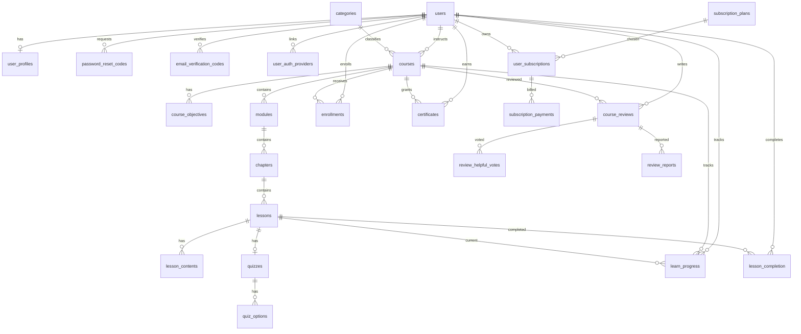

# Database Design

**Engine:** PostgreSQL
**Authoritative DDL:** `backend/src/db/schema.sql`
**Extension:** `pgcrypto` (for `gen_random_uuid()`)
**Migrations:** plain SQL in `backend/src/db/migrations/` (runner `npm run db:migrate`); no seed data.

## 1. Conventions

- Primary keys are `UUID DEFAULT gen_random_uuid()`.
- Timestamps use `TIMESTAMPTZ DEFAULT CURRENT_TIMESTAMP` unless noted.
- Tables with `updated_at` maintain it via the `set_updated_at()` trigger.
- Nearly all child foreign keys are `ON DELETE CASCADE`.
- List/aggregate queries use parameterized SQL in `backend/src/modules/<module>/*.repository.js`.

## 2. Entity Relationship Overview



## 3. Enum Types

| Enum | Values |
|---|---|
| `user_role` | `LEARNER`, `INSTRUCTOR`, `ADMIN` |
| `user_status` | `ACTIVE`, `INACTIVE`, `SUSPENDED` |
| `course_level` | `BEGINNER`, `INTERMEDIATE`, `ADVANCED` |
| `content_status` | `DRAFT`, `PUBLISHED` |
| `lesson_type` | `TEXT`, `QUIZ` |
| `subscription_status` | `ACTIVE`, `EXPIRED`, `CANCELLED` |
| `payment_status` | `PENDING`, `COMPLETED`, `FAILED`, `REFUNDED` |
| `access_course_type` | `FREE`, `SUBSCRIPTION` |
| `gender` | `MALE`, `FEMALE` |

## 4. Tables

### 4.1 Identity & User

#### `users`

| Column | Type | Constraints |
|---|---|---|
| id | UUID | PK, `gen_random_uuid()` |
| name | VARCHAR(255) | NOT NULL |
| email | VARCHAR(255) | UNIQUE, NOT NULL |
| image_url | TEXT | nullable |
| password | VARCHAR(255) | nullable (bcrypt hash; `NULL` for provider-only accounts) |
| role | user_role | DEFAULT `LEARNER` |
| status | user_status | DEFAULT `ACTIVE` |
| failed_login_attempts | INTEGER | DEFAULT 0 |
| locked_until | TIMESTAMPTZ | nullable |
| email_verified_at | TIMESTAMPTZ | nullable (`NULL` = unverified) |
| last_login | TIMESTAMPTZ | nullable |
| created_at | TIMESTAMPTZ | DEFAULT now |
| updated_at | TIMESTAMPTZ | DEFAULT now |

#### `user_profiles`

| Column | Type | Constraints |
|---|---|---|
| id | UUID | PK |
| user_id | UUID | UNIQUE, NOT NULL, FK → users(id) CASCADE |
| bio | TEXT | nullable |
| location | VARCHAR(255) | nullable |
| phone | VARCHAR(20) | nullable |
| date_birth | DATE | nullable |
| gender | gender | nullable |
| created_at / updated_at | TIMESTAMPTZ | DEFAULT now |

One-to-one with `users`.

#### `password_reset_codes`

| Column | Type | Constraints |
|---|---|---|
| id | UUID | PK |
| user_id | UUID | NOT NULL, FK → users(id) CASCADE |
| code | VARCHAR(255) | NOT NULL (HMAC-SHA256 hex) |
| attempts | INTEGER | DEFAULT 0 |
| expires_at | TIMESTAMPTZ | NOT NULL |
| created_at / updated_at | TIMESTAMPTZ | DEFAULT now |

> The column is `VARCHAR(255)`; the stored value is an HMAC-SHA256 hex digest keyed with `SESSION_SECRET`. (Formerly `VARCHAR(6)` — resolved, see §9.)

#### `email_verification_codes`

| Column | Type | Constraints |
|---|---|---|
| id | UUID | PK |
| user_id | UUID | NOT NULL, FK → users(id) CASCADE |
| code | VARCHAR(255) | NOT NULL (HMAC-SHA256 hex) |
| attempts | INTEGER | DEFAULT 0 |
| expires_at | TIMESTAMPTZ | NOT NULL |
| created_at / updated_at | TIMESTAMPTZ | DEFAULT now |

Separate from `password_reset_codes` (distinct flows). A new code invalidates
previous ones; codes are single-use, expire after 10 minutes, and cap attempts
at 5. Added in migration `0013`.

#### `user_auth_providers`

| Column | Type | Constraints |
|---|---|---|
| id | UUID | PK |
| user_id | UUID | NOT NULL, FK → users(id) CASCADE |
| provider | VARCHAR(50) | NOT NULL (e.g. `GOOGLE`) |
| provider_user_id | VARCHAR(255) | NOT NULL (provider's stable subject id) |
| provider_email | VARCHAR(255) | nullable |
| created_at / updated_at | TIMESTAMPTZ | DEFAULT now |
| | | `UNIQUE (provider, provider_user_id)` |

Links external identities to `users`. The unique constraint maps a provider
identity to exactly one user; a user may have email/password and/or provider
logins. Added in migration `0014` (which also makes `users.password` nullable
for provider-only accounts).

### 4.2 Catalog & Content

#### `categories`

| Column | Type | Constraints |
|---|---|---|
| id | UUID | PK |
| name | VARCHAR(255) | UNIQUE, NOT NULL |
| slug | TEXT | UNIQUE, NOT NULL |
| description | TEXT | nullable |
| created_at / updated_at | TIMESTAMPTZ | DEFAULT now |

#### `courses`

| Column | Type | Constraints |
|---|---|---|
| id | UUID | PK |
| instructor_id | UUID | NOT NULL, FK → users(id) CASCADE |
| category_id | UUID | NOT NULL, FK → categories(id) **RESTRICT** |
| name | VARCHAR(255) | NOT NULL |
| slug | TEXT | UNIQUE, NOT NULL |
| description | TEXT | NOT NULL |
| status | content_status | DEFAULT `DRAFT`, NOT NULL |
| level | course_level | DEFAULT `BEGINNER`, NOT NULL |
| access_type | access_course_type | DEFAULT `FREE` |
| position | INTEGER | nullable |
| deleted_at | TIMESTAMPTZ | nullable (soft delete) |
| created_at / updated_at | TIMESTAMPTZ | DEFAULT now |

#### `course_objectives`

| Column | Type | Constraints |
|---|---|---|
| id | UUID | PK |
| course_id | UUID | NOT NULL, FK → courses(id) CASCADE |
| content | TEXT | NOT NULL |
| position | INTEGER | DEFAULT 1 |
| created_at / updated_at | TIMESTAMPTZ | DEFAULT now |

#### `modules`

| Column | Type | Constraints |
|---|---|---|
| id | UUID | PK |
| course_id | UUID | NOT NULL, FK → courses(id) CASCADE |
| position | INTEGER | NOT NULL |
| name | VARCHAR(255) | NOT NULL |
| description | TEXT | nullable |
| status | content_status | DEFAULT `DRAFT`, NOT NULL |
| created_at / updated_at | TIMESTAMPTZ | DEFAULT now |

Unique `(course_id, position)`. Index `idx_modules_course`.

#### `chapters`

| Column | Type | Constraints |
|---|---|---|
| id | UUID | PK |
| module_id | UUID | NOT NULL, FK → modules(id) CASCADE |
| position | INTEGER | NOT NULL |
| name | VARCHAR(255) | NOT NULL |
| description | TEXT | nullable |
| status | content_status | DEFAULT `DRAFT`, NOT NULL |
| created_at / updated_at | TIMESTAMPTZ | DEFAULT now |

Unique `(module_id, position)`. Index `idx_chapters_module`.

#### `lessons`

| Column | Type | Constraints |
|---|---|---|
| id | UUID | PK |
| chapter_id | UUID | NOT NULL, FK → chapters(id) CASCADE |
| position | INTEGER | NOT NULL |
| name | VARCHAR(255) | NOT NULL |
| description | TEXT | nullable |
| type | lesson_type | NOT NULL |
| status | content_status | DEFAULT `DRAFT`, NOT NULL |
| access_type | access_course_type | DEFAULT `FREE` |
| xp_points | INTEGER | DEFAULT 5, CHECK ≥ 0 |
| duration_minutes | INTEGER | DEFAULT 0, CHECK ≥ 0 |
| created_at / updated_at | TIMESTAMPTZ | DEFAULT now |

Unique `(chapter_id, position)`. Index `idx_lessons_chapter`.

#### `lesson_contents`

| Column | Type | Constraints |
|---|---|---|
| id | UUID | PK |
| lesson_id | UUID | NOT NULL, FK → lessons(id) CASCADE |
| position | INTEGER | NOT NULL |
| name | VARCHAR(255) | NOT NULL |
| content | TEXT | NOT NULL |
| created_at / updated_at | TIMESTAMPTZ | DEFAULT now |

Unique `(lesson_id, position)`. Index `idx_lesson_contents_lesson`.

#### `quizzes`

| Column | Type | Constraints |
|---|---|---|
| id | UUID | PK |
| lesson_id | UUID | NOT NULL, FK → lessons(id) CASCADE |
| question | TEXT | NOT NULL |
| explanation | TEXT | nullable |
| position | INTEGER | NOT NULL |
| created_at / updated_at | TIMESTAMPTZ | DEFAULT now |

Unique `(lesson_id, position)`. Index `idx_quizzes_lesson`.

#### `quiz_options`

| Column | Type | Constraints |
|---|---|---|
| id | UUID | PK |
| quiz_id | UUID | NOT NULL, FK → quizzes(id) CASCADE |
| text | TEXT | NOT NULL |
| is_correct | BOOLEAN | DEFAULT FALSE |
| position | INTEGER | NOT NULL |
| created_at / updated_at | TIMESTAMPTZ | DEFAULT now |

Unique `(quiz_id, position)`. Index `idx_quiz_options_quiz`.

### 4.3 Learning

#### `enrollments`

| Column | Type | Constraints |
|---|---|---|
| id | UUID | PK |
| user_id | UUID | NOT NULL, FK → users(id) CASCADE |
| course_id | UUID | NOT NULL, FK → courses(id) CASCADE |
| access_type | access_course_type | DEFAULT `FREE` |
| enrolled_at | TIMESTAMPTZ | DEFAULT now |
| expires_at | TIMESTAMPTZ | nullable |
| updated_at | TIMESTAMPTZ | DEFAULT now |

Unique `(user_id, course_id)`. Indexes `idx_enrollments_user`, `idx_enrollments_course`. No `created_at`.

#### `learn_progress`

| Column | Type | Constraints |
|---|---|---|
| id | UUID | PK |
| user_id | UUID | NOT NULL, FK → users(id) CASCADE |
| course_id | UUID | NOT NULL, FK → courses(id) CASCADE |
| lesson_id | UUID | nullable, FK → lessons(id) **SET NULL** |
| created_at / updated_at | TIMESTAMPTZ | DEFAULT now |

Unique `(user_id, course_id)`. Indexes `idx_learn_progress_user`, `idx_learn_progress_course`.

#### `lesson_completion`

| Column | Type | Constraints |
|---|---|---|
| id | UUID | PK |
| user_id | UUID | NOT NULL, FK → users(id) CASCADE |
| course_id | UUID | NOT NULL, FK → courses(id) CASCADE |
| lesson_id | UUID | NOT NULL, FK → lessons(id) CASCADE |
| completed_at | TIMESTAMP | NOT NULL, DEFAULT NOW() |
| time_spent_minutes | INTEGER | DEFAULT 0 |
| xp_earned | INTEGER | NOT NULL |
| created_at | TIMESTAMP | NOT NULL, DEFAULT NOW() |

Unique `(user_id, lesson_id)`. Indexes `idx_lesson_completion_user`, `idx_lesson_completion_lesson`. No `updated_at`/trigger.

#### `certificates`

| Column | Type | Constraints |
|---|---|---|
| id | UUID | PK |
| user_id | UUID | NOT NULL, FK → users(id) CASCADE |
| course_id | UUID | NOT NULL, FK → courses(id) CASCADE |
| confirm | BOOLEAN | DEFAULT FALSE |
| certificate_number | VARCHAR(100) | UNIQUE, NOT NULL |
| certificate_url | TEXT | nullable (unused) |
| issued_at | TIMESTAMPTZ | DEFAULT now |

Unique `(user_id, course_id)`. Indexes `idx_certificates_user`, `idx_certificates_course`. No `updated_at`.

### 4.4 Subscriptions & Payments

#### `subscription_plans`

| Column | Type | Constraints |
|---|---|---|
| id | UUID | PK |
| name | VARCHAR(50) | NOT NULL |
| duration_days | INT | NOT NULL |
| price | NUMERIC(10,2) | NOT NULL, CHECK ≥ 0 |
| created_at / updated_at | TIMESTAMPTZ | DEFAULT now |

Unique `(name, duration_days)`.

#### `user_subscriptions`

| Column | Type | Constraints |
|---|---|---|
| id | UUID | PK |
| user_id | UUID | NOT NULL, FK → users(id) CASCADE |
| plan_id | UUID | NOT NULL, FK → subscription_plans(id) CASCADE |
| start_date | TIMESTAMPTZ | DEFAULT now |
| end_date | TIMESTAMPTZ | NOT NULL |
| status | subscription_status | DEFAULT `ACTIVE` |
| created_at / updated_at | TIMESTAMPTZ | DEFAULT now |

Partial unique `one_active_subscription_per_user` on `(user_id) WHERE status='ACTIVE'`. Index `idx_user_subscriptions_user`.

#### `subscription_payments`

| Column | Type | Constraints |
|---|---|---|
| id | UUID | PK |
| user_subscription_id | UUID | NOT NULL, FK → user_subscriptions(id) CASCADE |
| amount | NUMERIC(10,2) | NOT NULL, CHECK ≥ 0 |
| payment_status | payment_status | DEFAULT `PENDING` |
| stripe_payment_intent_id | TEXT | UNIQUE, nullable |
| created_at / updated_at | TIMESTAMPTZ | DEFAULT now |

Index `idx_subscription_payment_user_subscription`.

### 4.5 Reviews & Moderation

#### `course_reviews`

| Column | Type | Constraints |
|---|---|---|
| id | UUID | PK |
| user_id | UUID | NOT NULL, FK → users(id) CASCADE |
| course_id | UUID | NOT NULL, FK → courses(id) CASCADE |
| rating | INTEGER | NOT NULL, CHECK BETWEEN 1 AND 5 |
| review | TEXT | nullable |
| created_at / updated_at | TIMESTAMPTZ | DEFAULT now |

Unique `(user_id, course_id)`. Indexes `idx_course_reviews_course`, `idx_course_reviews_user`.

#### `review_helpful_votes`

| Column | Type | Constraints |
|---|---|---|
| id | UUID | PK |
| user_id | UUID | NOT NULL, FK → users(id) CASCADE |
| review_id | UUID | NOT NULL, FK → course_reviews(id) CASCADE |
| is_helpful | BOOLEAN | NOT NULL |
| created_at | TIMESTAMPTZ | DEFAULT now |

Unique `(user_id, review_id)`.

#### `review_reports`

| Column | Type | Constraints |
|---|---|---|
| id | UUID | PK |
| user_id | UUID | NOT NULL, FK → users(id) CASCADE |
| review_id | UUID | NOT NULL, FK → course_reviews(id) CASCADE |
| reason | VARCHAR(255) | NOT NULL |
| description | TEXT | nullable |
| created_at | TIMESTAMPTZ | DEFAULT now |

Unique `(user_id, review_id)`.

### 4.6 Runtime Table

#### `session`
Created automatically by `connect-pg-simple` (`createTableIfMissing: true`) in `backend/src/common/middleware/session-middleware.js`. Not in `schema.sql`; a fresh database has 23 tables after the server runs.

## 5. Triggers & Functions

- `set_updated_at()` — sets `NEW.updated_at = CURRENT_TIMESTAMP`.
- 19 `BEFORE UPDATE` triggers, one per table with `updated_at`.
- Tables without triggers: `lesson_completion`, `certificates`, `review_helpful_votes`, `review_reports`.

## 6. Indexes & Unique Constraints

Explicit indexes: `idx_modules_course`, `idx_chapters_module`, `idx_lessons_chapter`, `idx_lesson_contents_lesson`, `idx_quizzes_lesson`, `idx_quiz_options_quiz`, `idx_enrollments_user`, `idx_enrollments_course`, `idx_user_subscriptions_user`, `idx_subscription_payment_user_subscription`, `idx_course_reviews_course`, `idx_course_reviews_user`, `idx_learn_progress_user`, `idx_learn_progress_course`, `idx_lesson_completion_user`, `idx_lesson_completion_lesson`, `idx_certificates_user`, `idx_certificates_course`, `idx_user_auth_providers_user`, plus the partial unique `one_active_subscription_per_user`.

Composite unique constraints: `unique_modules_course_position`, `unique_chapters_module_position`, `unique_lessons_chapter_position`, `unique_lesson_contents_lesson_position`, `unique_quizzes_lesson_position`, `unique_quiz_options_quiz_position`, `unique_user_course` (enrollments), `unique_plan_duration`, `unique_user_review`, `unique_user_vote`, `unique_user_report`, `unique_user_course_progress`, `unique_user_lesson_completion`, `unique_user_course_certificate`, `uq_user_auth_provider`.

## 7. Cascade & Integrity Rules

| FK | On Delete |
|---|---|
| courses.category_id → categories.id | **RESTRICT** |
| learn_progress.lesson_id → lessons.id | **SET NULL** |
| All other child FKs | **CASCADE** |

Deleting a user cascades to their courses, enrollments, progress, completions, certificates, reviews, and subscriptions. Deleting a course cascades to its entire content tree and learner data.

## 8. Repository Mapping

| Repository | Tables |
|---|---|
| `UserRepository` | users, user_profiles |
| `PasswordResetCodeRepository` | password_reset_codes |
| `EmailVerificationCodeRepository` | email_verification_codes |
| `AuthProviderRepository` | user_auth_providers |
| `CategoryRepository` | categories |
| `CourseRepository` | courses, course_reviews, modules, chapters, lessons, enrollments, learn_progress, lesson_completion |
| `CourseObjectiveRepository` | course_objectives |
| `ModuleRepository` | modules, courses |
| `ChapterRepository` | chapters, modules, courses |
| `LessonRepository` | lessons, quizzes, quiz_options, chapters, modules, courses |
| `LessonContentRepository` | lesson_contents |
| `QuestionRepository` | quizzes, lessons, chapters, modules, courses |
| `OptionRepository` | quiz_options, quizzes, lessons, chapters, modules |
| `EnrollmentRepository` | enrollments |
| `LearningProgressRepository` | learn_progress |
| `LessonCompletionRepository` | lesson_completion |
| `CertificateRepository` | certificates, courses, users, lessons, chapters, modules, lesson_completion |
| `SubscriptionRepository` | subscription_plans, user_subscriptions, subscription_payments, users |
| `ReviewRepository` | course_reviews, review_helpful_votes, review_reports, users |

## 9. Schema Drift

| # | Issue | Status | Resolution |
|---|---|---|---|
| 1 | `lesson_contents` (code) vs `lesson_content` (schema) | ✅ Resolved | Canonical `lesson_contents`; `schema.sql` + migration `0011` |
| 2 | `lessons.access_type` referenced but missing | ✅ Resolved | Column added (`access_course_type DEFAULT 'FREE'`) |
| 3 | `quizzes.lesson_id` `UNIQUE` | ✅ Resolved | Constraint dropped; `(lesson_id, position)` kept |
| 4 | `password_reset_codes.code` too small for a hash | ✅ Resolved | Widened to `VARCHAR(255)`; HMAC-SHA256 stored |
| 5 | `modules.icon_name` used by code but not defined | ✅ Resolved | Never existed; code usage removed |
| 6 | `course_reviews.helpful_count` not maintained | ✅ Resolved | Column dropped; count derives from votes |
| 7 | `getPopular` counts `lesson_completion`, not `enrollments` | ✅ Resolved | Counts `enrollments` |
| 8 | No indexes on `courses.instructor_id/category_id/deleted_at` | ✅ Resolved | Indexes added (migration `0009`) |

## 10. Applying the Schema

```bash
# Fresh database
psql "$DATABASE_URL" -f backend/src/db/schema.sql

# Existing database: apply incremental migrations
npm run db:migrate      # apply pending
npm run db:status       # list applied/pending
```

The `session` table is created automatically on first backend start. Migrations live in `backend/src/db/migrations/` and are tracked in `schema_migrations`.
