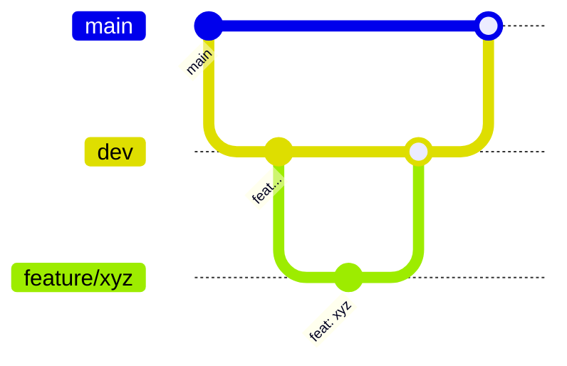

# Git Workflow

## 1. Remote & Branches

- Remote: `origin` → `https://github.com/Rafy-Tho/Learning_Online_Platform_Pern.git`
- Default branch: `main`
- Active integration branch: `dev`
- Feature branches use descriptive kebab-case names, e.g. `refactor-route-subscription`

Current branches:

| Branch | Role |
|---|---|
| `main` | Default/stable |
| `dev` | Integration branch |
| `refactor-route-subscription` | Feature/refactor branch (merged via PR) |

## 2. Branch Strategy



- Branch off `dev` for features/fixes.
- Open a pull request into `dev` (or `main` for releases).
- Keep branches short-lived and rebased/merged promptly.

## 3. Commit Messages

Use **Conventional Commits**:

```text
<type>: <short imperative description>
```

Common types:

| Type | Use |
|---|---|
| `feat` | New feature |
| `fix` | Bug fix |
| `refactor` | Code change without behavior change |
| `docs` | Documentation only |
| `chore` | Build/tooling/deps |
| `test` | Tests |
| `style` | Formatting only |

Examples from the repo:

```text
feat: implement user subscription management; update payment handling
fix: update sameSite attribute for session cookie to 'none' in production
refactor: standardize gender options in PersonalInfoSection
feat: add SubscriptionsPageSkeleton component and integrate it into SubscriptionsPage
```

Guidelines:

- Use imperative mood ("add", not "added").
- Keep the subject ≤ ~72 characters.
- Scope to one logical change per commit.
- Older commits may use plain imperative sentences without a prefix; prefer Conventional Commits going forward.

## 4. Pull Requests

- Target `dev` for feature work, `main` for releases.
- PR description should cover: what changed, why, how to test, and any migration/config impact.
- Review the full diff, not just the latest commit.
- Ensure lint passes for the affected app before requesting review.
- Merges in the repo history use merge commits (`Merge pull request #N from ...`).

## 5. Pre-Commit Checklist

1. `npm run lint` in `frontend/` and `admin/`; `npx eslint .` in `backend/`.
2. No `.env` or secret files staged (they are gitignored).
3. No `console.log` left behind (`no-console: warn`).
4. No dead code or unused variables.
5. Update docs/`ai` rules if architecture or conventions change.
6. For schema changes, add an idempotent, CREATE-only migration in `backend/src/db/migrations/` (the schema source of truth).

## 6. What Not to Do

- Do not commit directly to `main`.
- Do not force-push shared branches.
- Do not commit `node_modules`, `dist`, `.env`, or uploaded files.
- Do not mix unrelated changes in one commit.
- Do not commit secrets; rotate immediately if one leaks.

## 7. Ignored Paths (`.gitignore`)

```text
logs, *.log, npm-debug.log*, yarn-debug.log*, yarn-error.log*, pnpm-debug.log*
node_modules
dist
dist-ssr
*.local
.env
.env.test
.vscode/*
!.vscode/extensions.json
.idea
.DS_Store
*.suo
*.ntvs*
*.njsproj
*.sln
*.sw?
```

Note: `.env` is ignored, but `.vscode/settings.json` exists locally and is not tracked (all `.vscode/*` ignored except `extensions.json`).
