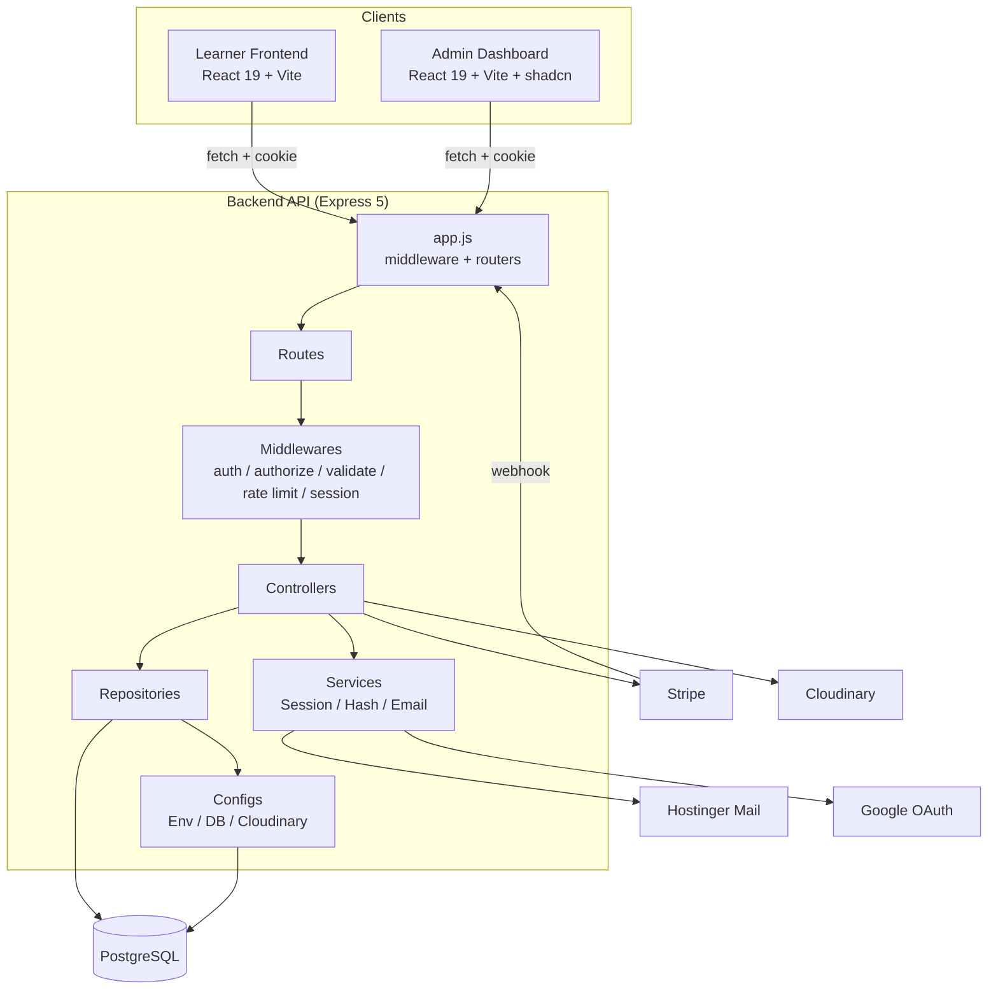
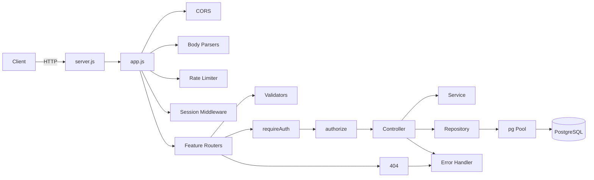
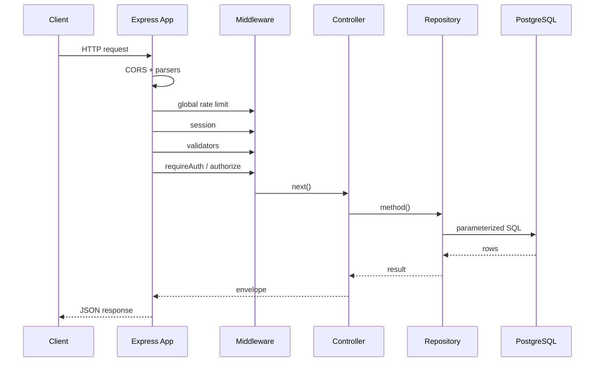
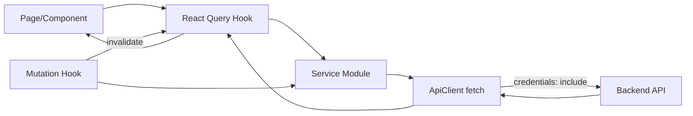
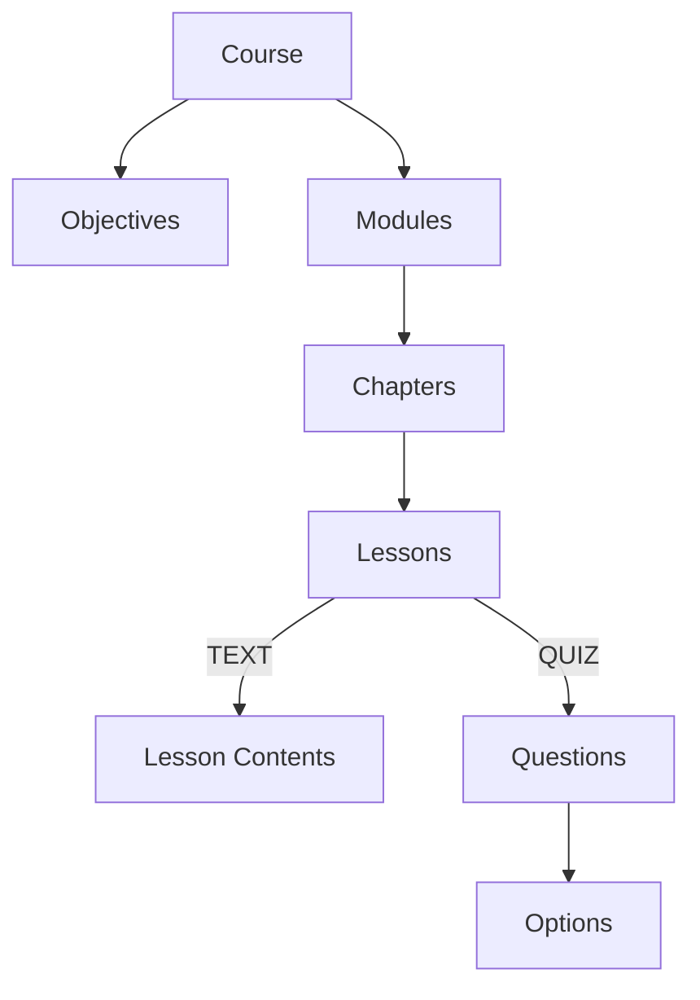
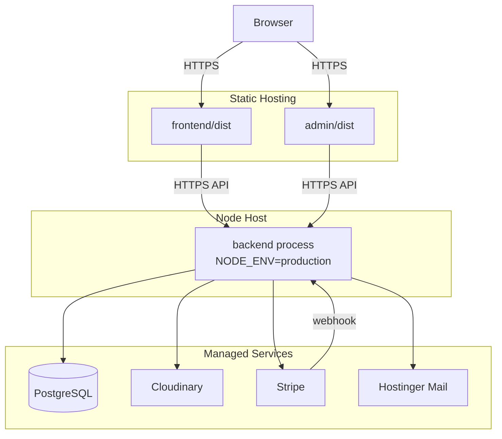
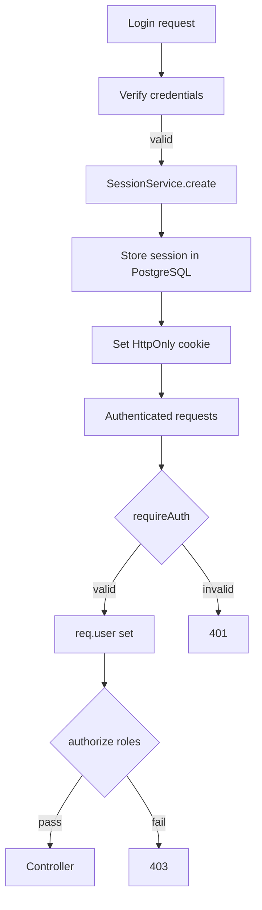

# Architecture Diagrams

## 1. Component Diagram

## 2. Backend Layer Diagram

## 3. Request Processing Sequence

## 4. Frontend Data Flow (Learner)

## 5. Admin Content Tree

## 6. Deployment Diagram

## 7. Session & Auth Flow

