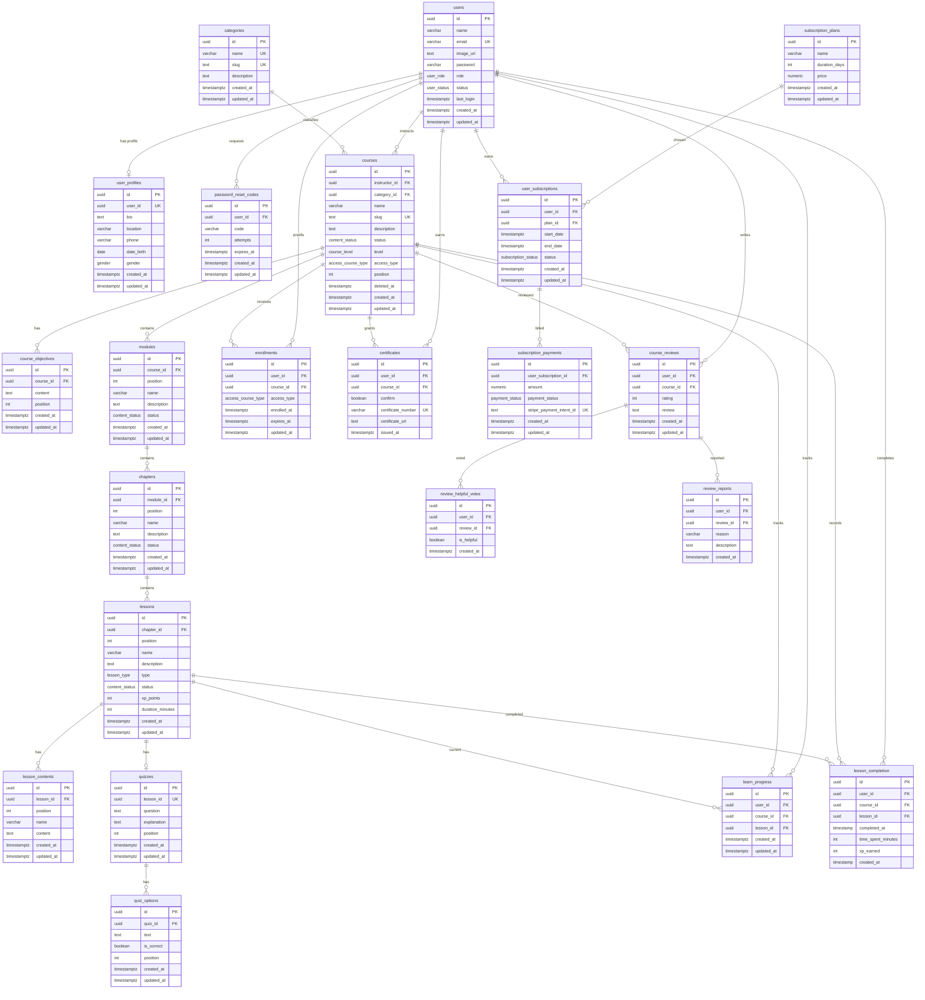
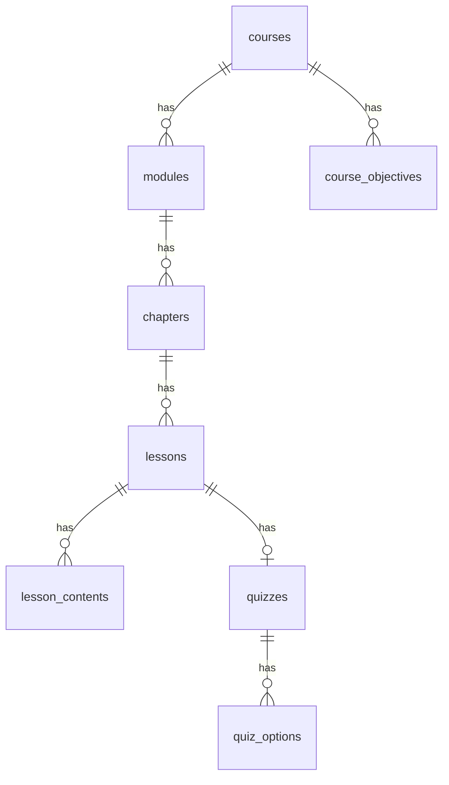
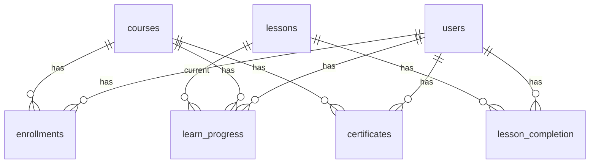
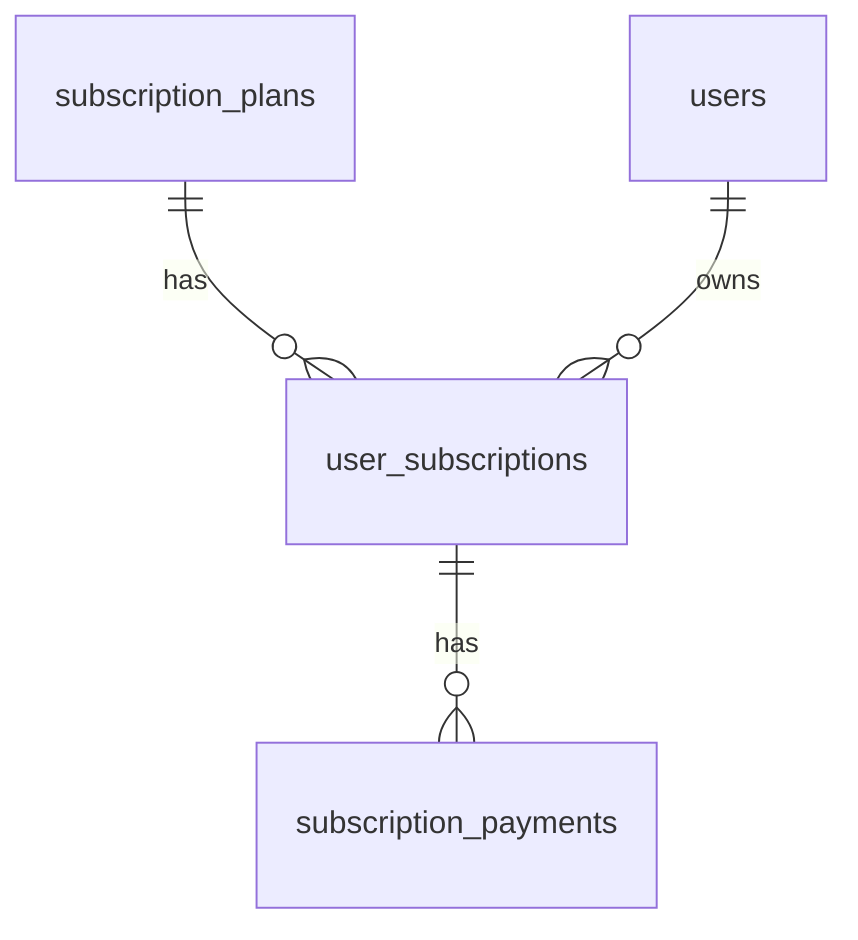
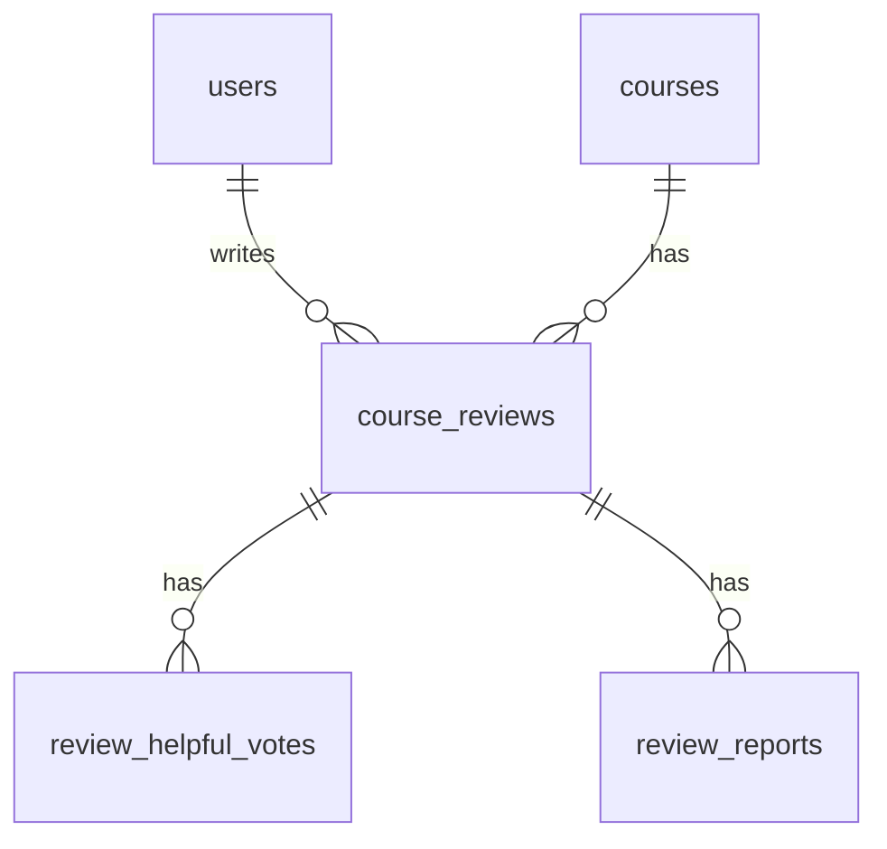

# Entity Relationship Diagram (ERD)

The database contains 22 declared tables plus a runtime `session` table. Grouped by domain for readability.

## 1. Full ERD

## 2. Content Hierarchy

## 3. Learning Domain

## 4. Billing Domain

## 5. Reviews Domain

## 6. Relationship & Constraint Summary

| Parent | Child | FK | On Delete | Cardinality |
|---|---|---|---|---|
| users | user_profiles | user_id | CASCADE | 1:1 |
| users | password_reset_codes | user_id | CASCADE | 1:N |
| users | courses | instructor_id | CASCADE | 1:N |
| categories | courses | category_id | **RESTRICT** | 1:N |
| courses | course_objectives | course_id | CASCADE | 1:N |
| courses | modules | course_id | CASCADE | 1:N |
| modules | chapters | module_id | CASCADE | 1:N |
| chapters | lessons | chapter_id | CASCADE | 1:N |
| lessons | lesson_contents | lesson_id | CASCADE | 1:N |
| lessons | quizzes | lesson_id | CASCADE | 1:1 |
| quizzes | quiz_options | quiz_id | CASCADE | 1:N |
| users | enrollments | user_id | CASCADE | 1:N |
| courses | enrollments | course_id | CASCADE | 1:N |
| users | learn_progress | user_id | CASCADE | 1:N |
| courses | learn_progress | course_id | CASCADE | 1:N |
| lessons | learn_progress | lesson_id | **SET NULL** | 1:N |
| users | lesson_completion | user_id | CASCADE | 1:N |
| lessons | lesson_completion | lesson_id | CASCADE | 1:N |
| users | certificates | user_id | CASCADE | 1:N |
| courses | certificates | course_id | CASCADE | 1:N |
| subscription_plans | user_subscriptions | plan_id | CASCADE | 1:N |
| users | user_subscriptions | user_id | CASCADE | 1:N (≤1 ACTIVE) |
| user_subscriptions | subscription_payments | user_subscription_id | CASCADE | 1:N |
| users | course_reviews | user_id | CASCADE | 1:N |
| courses | course_reviews | course_id | CASCADE | 1:N |
| course_reviews | review_helpful_votes | review_id | CASCADE | 1:N |
| course_reviews | review_reports | review_id | CASCADE | 1:N |

### Key Unique Constraints

| Table | Unique |
|---|---|
| users | email |
| categories | name, slug |
| courses | slug |
| modules | (course_id, position) |
| chapters | (module_id, position) |
| lessons | (chapter_id, position) |
| lesson_contents | (lesson_id, position) |
| quizzes | lesson_id, (lesson_id, position) |
| quiz_options | (quiz_id, position) |
| enrollments | (user_id, course_id) |
| learn_progress | (user_id, course_id) |
| lesson_completion | (user_id, lesson_id) |
| certificates | (user_id, course_id), certificate_number |
| subscription_plans | (name, duration_days) |
| user_subscriptions | (user_id) WHERE status='ACTIVE' |
| subscription_payments | stripe_payment_intent_id |
| course_reviews | (user_id, course_id) |
| review_helpful_votes | (user_id, review_id) |
| review_reports | (user_id, review_id) |

> **Note:** The ERD reflects `schema.sql`. The former drift (`lesson_contents`, `lessons.access_type`, `password_reset_codes.code`) is resolved; see `docs/04-design/database-design.md` §9.
