# Sequence Diagrams

Detailed interaction flows across clients, API, database, and external services.

## 1. Login

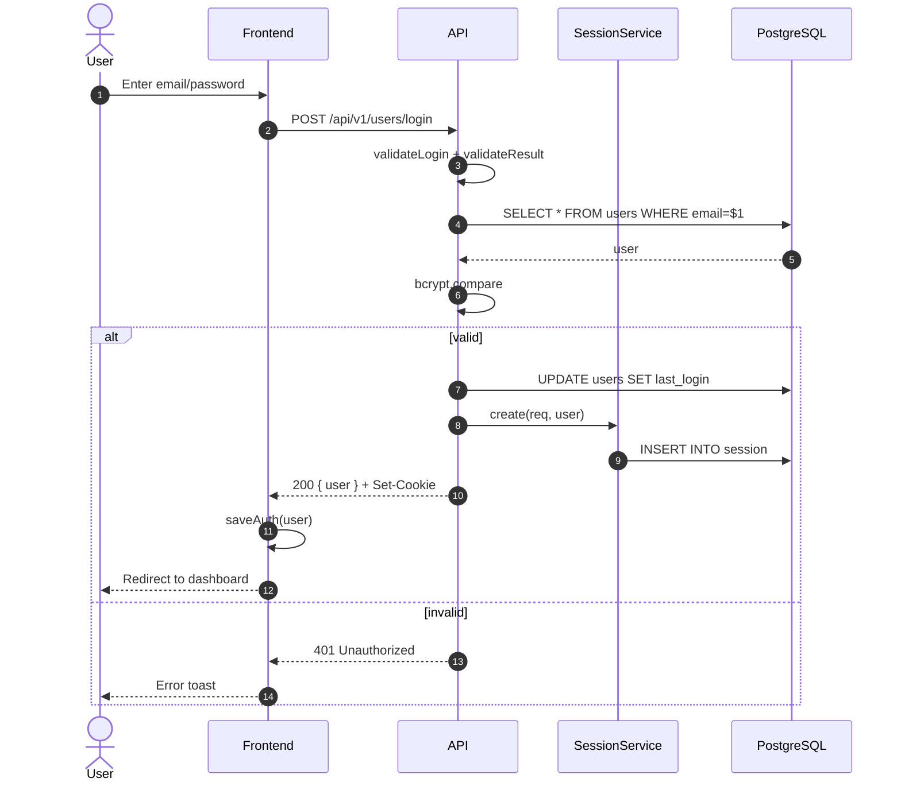

## 2. Registration

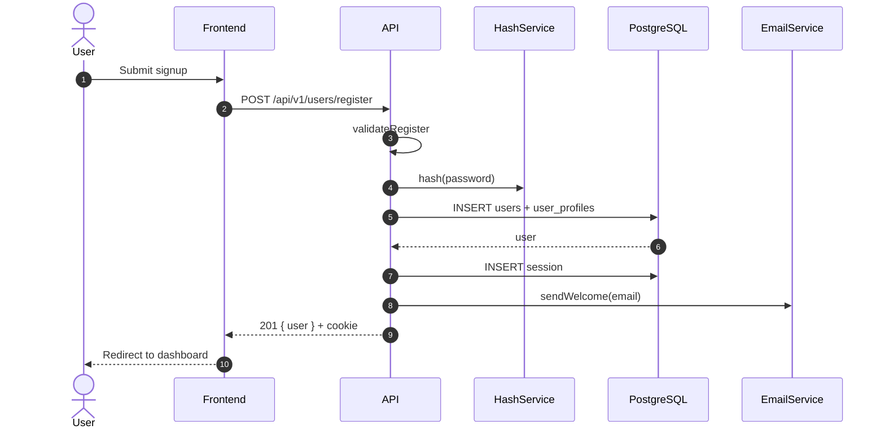

## 3. Password Reset

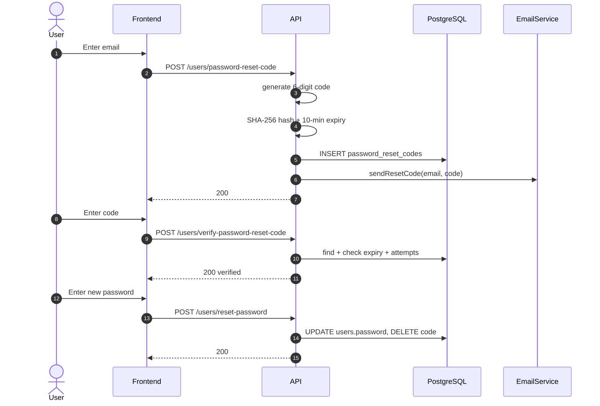

## 4. Course Discovery & Enrollment

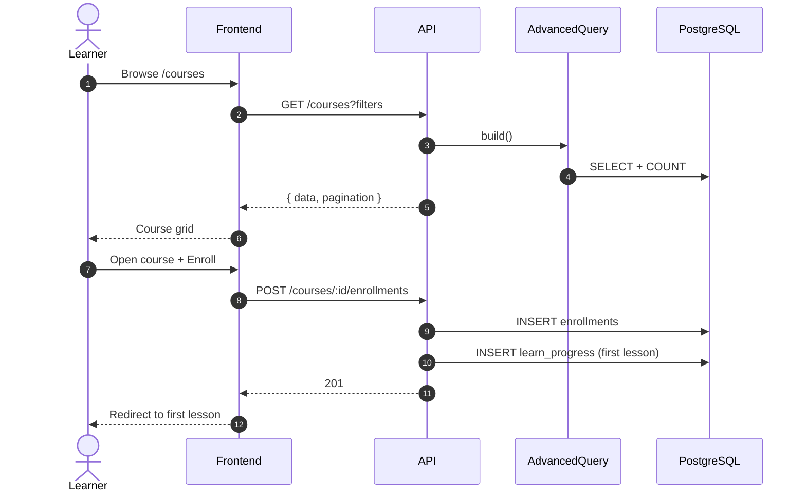

## 5. Learning a Lesson

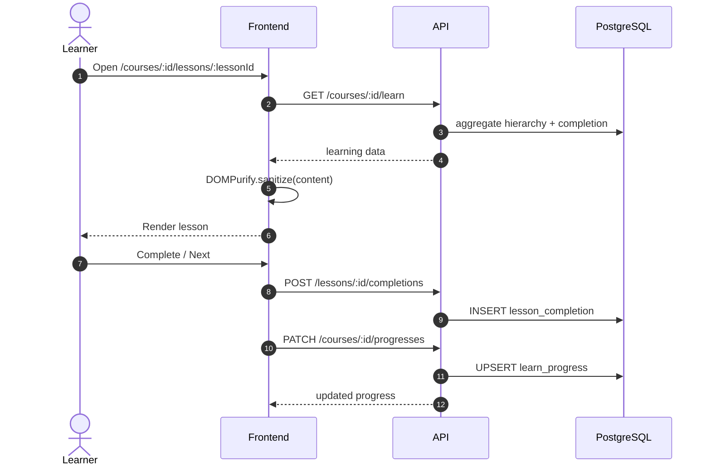

## 6. Quiz Attempt

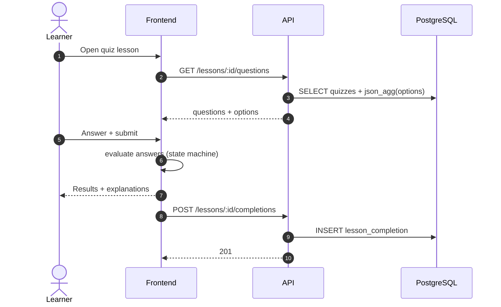

## 7. Review Submission

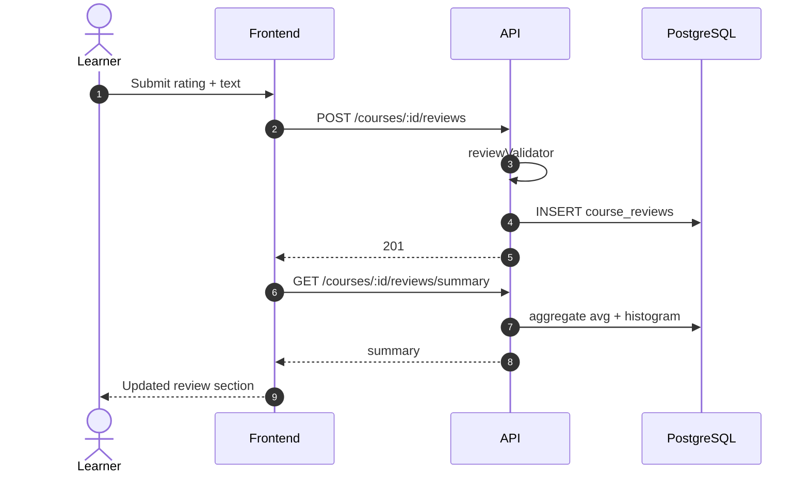

## 8. Helpful Vote Toggle

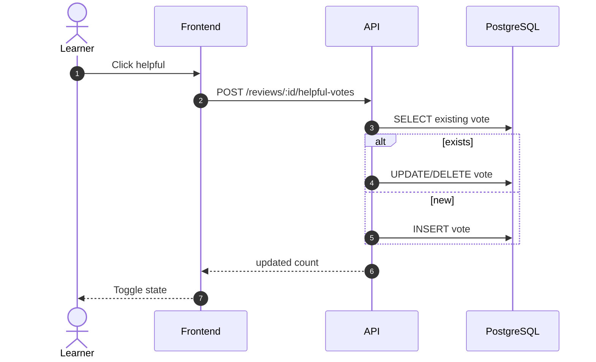

## 9. Subscription Checkout & Webhook

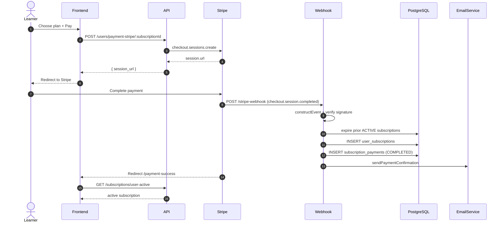

## 10. Admin Course Authoring

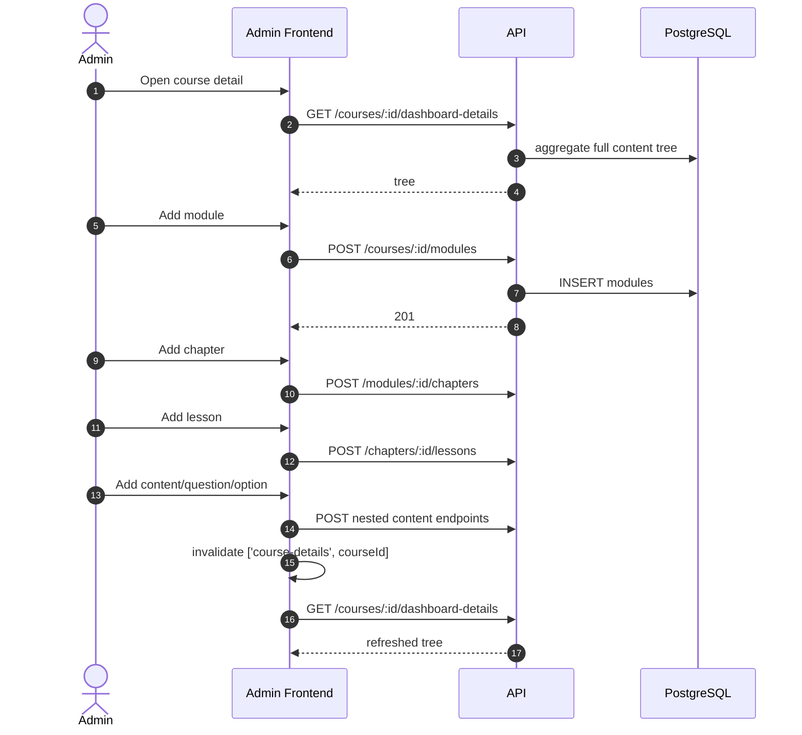

## 11. Session Validation (Protected Request)

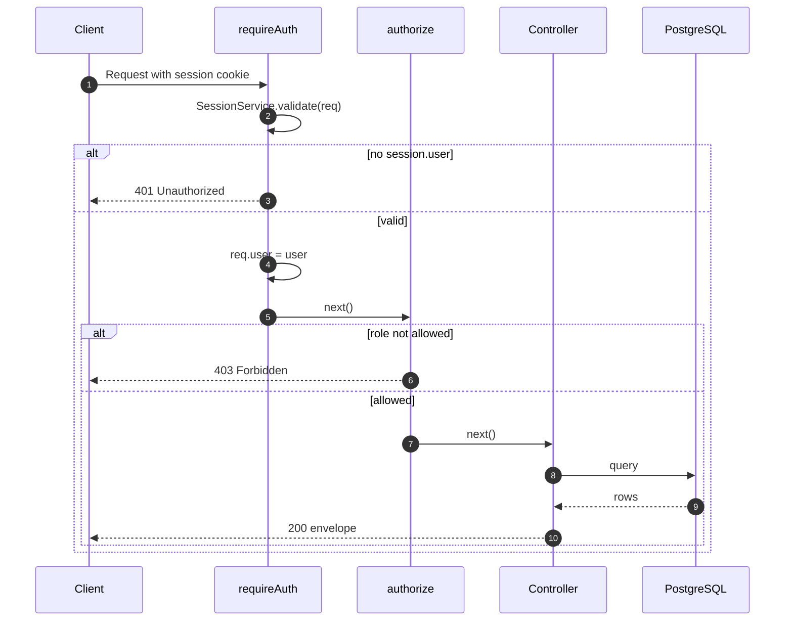

## 12. Error Handling

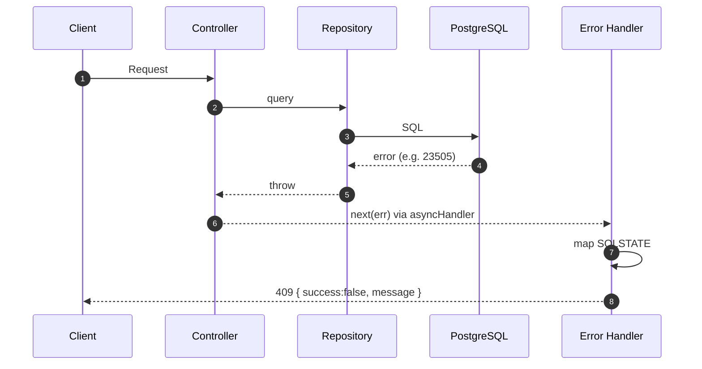
