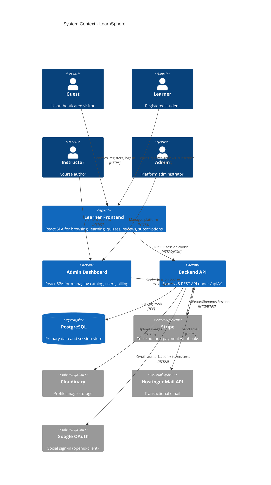
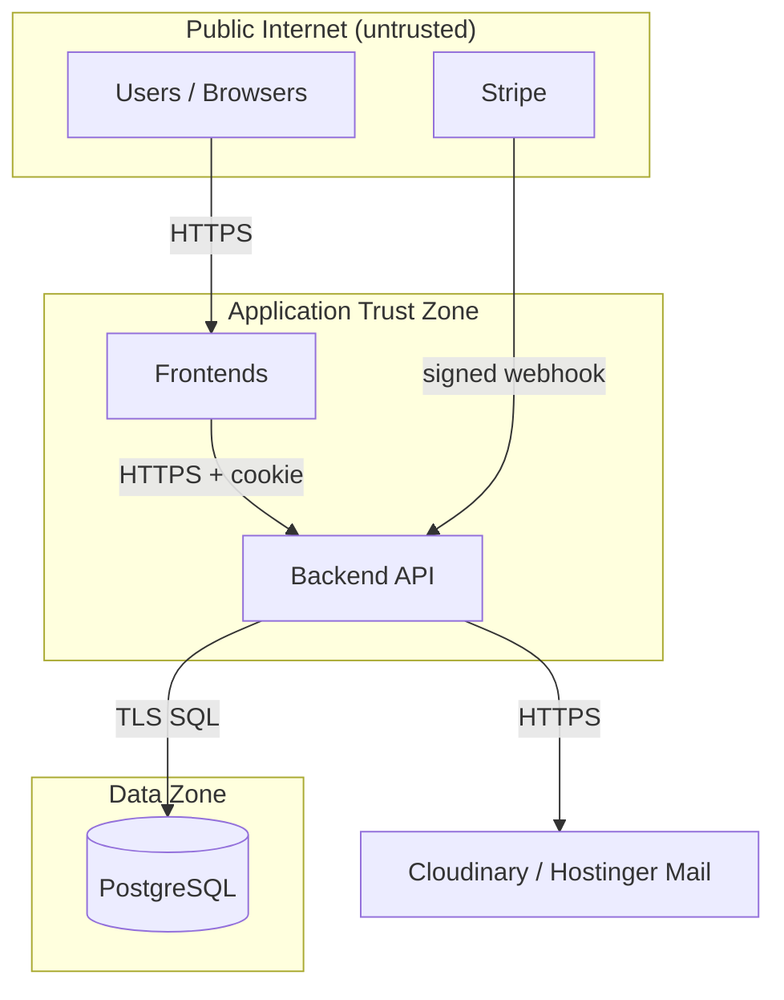

# System Context Diagram

The system context shows the platform, its actors, and external services.

## Actors

| Actor | Interacts With | Description |
|---|---|---|
| Guest | Learner frontend | Browse, register, log in, reset password |
| Learner | Learner frontend | Enroll, learn, quiz, review, subscribe |
| Instructor | Admin dashboard | Author and manage owned courses |
| Admin | Admin dashboard | Manage users, catalog, billing |

## External Systems

| System | Direction | Purpose |
|---|---|---|
| PostgreSQL | Bidirectional | Data persistence and session storage |
| Stripe | Outbound (checkout) + inbound (webhook) | Payment processing |
| Cloudinary | Outbound | Profile image storage |
| Hostinger Mail API | Outbound | Welcome, verification, reset-code, and payment emails |
| Google OAuth | Inbound (redirect callback) | Social sign-in |

## Trust Boundaries

Notes:

- The backend is the only component with database credentials.
- The Stripe webhook is authenticated by signature, not session.
- Frontends never receive server secrets.
